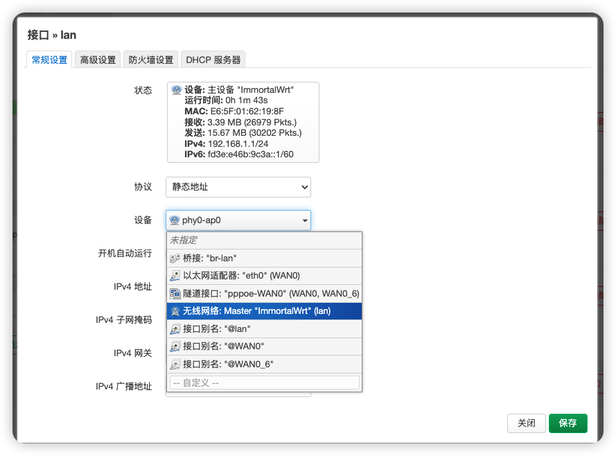
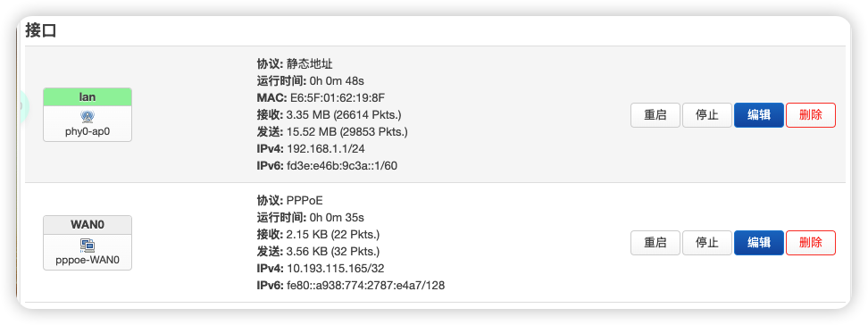

[🇨🇳 中文文档](#chinese) | [🇺🇸 English](#english)

# 树莓派 OpenWrt 软路由配置指南

  

## 前言

官方 OpenWrt 固件过于精简，因此我选择了功能更丰富的 ImmortalWrt，它提供了更多插件以及 CDN 加速源，大大提升了使用体验。本文记录了我在树莓派上配置 OpenWrt 软路由的完整过程，希望能帮助到有类似需求的朋友。

## 硬件环境

- 设备：Raspberry Pi 4B/400/CM4 (64bit)

## 固件选择

- 固件源：`ImmortalWrt Firmware Selector ： https://firmware-selector.immortalwrt.org/ `
- 注意事项：
  - EXT4 版本会覆盖掉所有的用户设置 `(如果需要重新配置，请刷入此固件！)`
  - SQUASHFS 版本写入后，用户的配置不变
具体固件包可以在release中找到。

## 烧录固件
- 烧录工具：
    - rufus(windows)：https://rufus.ie
    - etcher(windows/linux/macos)：https://etcher.balena.io/#download-etcher
    - diskgenius(windows)：https://www.diskgenius.cn/download.php
    - 微PE(windows)：https://www.wepe.com.cn/download.html
    - DiskImage(windows)：https://roadkil.net/download.php?FileID=409&ProgramID=12

- 注意事项：
  - 烧录前请先格式化 SD 卡
  - 烧录完成后，SD 卡会自动弹出
  - 烧录过程中，请勿移除 SD 卡

## 初始配置

### 连接到 OpenWrt

1. 使用网线直连树莓派
2. 更改本地以太网 IPv4 地址为 192.168.1.x 网段， 子网掩码255.255.255.0
3. 访问 192.168.1.1 进入 OpenWrt 后台

> 此方法适用于最简单以及复杂的校园网环境（尤其是同一个实验室中出现不同局域网的情况）

  

### 基础设置

- 默认账户：root
- 默认密码：  （空）
- 关闭 IPv6 相关设置（参考视频 24:42）https://www.youtube.com/watch?v=JfSJmPFiL_s&t=344s

## 网络配置

### 单网口树莓派配置 WAN 和 LAN

<strong> 最初考虑使用 VLAN 技术实现单网口分离 WAN 和 LAN，但由于交换机不支持 VLAN，最终放弃这种方式。 </strong>

### 校园网拨号解决方案

校园网拨号较为复杂，可能会识别出设备类型导致连接失败。

  

解决方法：

1. 新建 WAN0 接口，配置拨号账户
2. LAN 设置：将设备改为无线网络
3. 如遇问题，请将 WiFi 放置在最高优先级后再测试！

  

  

## 功能扩展

### 主题美化

安装 cargo luci 主题，提升界面美观度（参考视频 33:12）https://www.youtube.com/watch?v=JfSJmPFiL_s&t=344s 

### 科学上网配置

1. 安装科学上网插件
> 根据个人喜好下载添加即可（不能重复同时使用！）
- Openclash
- passWall
- 略

2. 自定义规则添加：
   - [OpenClash 维护指南](https://blog.dreamtobe.cn/openclash_maintain/)
   - [自定义 OpenClash 规则](https://github.com/Aethersailor/Custom_OpenClash_Rules)

## 参考资料

- [不良林 OpenWrt 视频教程](https://www.youtube.com/watch?v=JfSJmPFiL_s)
- [不良林 OpenWrt 文字教程](https://bulianglin.com/archives/openwrt.html)
- [树莓派安装 OpenWrt 作为主路由及解决校园网登录问题](https://www.bilibili.com/video/xxx)

## 总结

通过以上配置，成功将树莓派打造成了一台功能强大的软路由，解决了校园网环境下的网络连接问题，并实现了科学上网等高级功能。ImmortalWrt 相比官方 OpenWrt 提供了更丰富的插件支持，大大提升了使用体验。

希望这份配置指南能对你有所帮助！如有问题，欢迎在评论区交流讨论。

[🇨🇳 中文文档](#chinese) | [🇺🇸 English](#english)

# Raspberry Pi OpenWrt Software Router Configuration Guide

  

## Introduction

The official OpenWrt firmware is too minimalistic, so I chose the feature-rich ImmortalWrt, which provides more plugins and CDN acceleration sources, greatly enhancing the user experience. This article documents my complete process of configuring an OpenWrt software router on a Raspberry Pi, hoping to help others with similar needs.

## Hardware Environment

- Device: Raspberry Pi 4B/400/CM4 (64bit)

## Firmware Selection

- Firmware Source: `ImmortalWrt Firmware Selector: https://firmware-selector.immortalwrt.org/`
- Notes:
  - EXT4 version will overwrite all user settings `(If you need to reconfigure, please flash this firmware!)`
  - SQUASHFS version preserves user configurations after writing
  
You can find specific firmware packages in the release section.

## Flashing the Firmware
- Flashing Tools:
    - rufus (Windows): https://rufus.ie
    - etcher (Windows/Linux/macOS): https://etcher.balena.io/#download-etcher
    - diskgenius (Windows): https://www.diskgenius.cn/download.php
    - WePE (Windows): https://www.wepe.com.cn/download.html
    - DiskImage (Windows): https://roadkil.net/download.php?FileID=409&ProgramID=12

- Important Notes:
  - Format the SD card before flashing
  - The SD card will automatically eject after flashing
  - Do not remove the SD card during the flashing process

## Initial Configuration

### Connecting to OpenWrt

1. Connect the Raspberry Pi directly with an Ethernet cable
2. Change your local Ethernet IPv4 address to the 192.168.1.x subnet, with subnet mask 255.255.255.0
3. Access 192.168.1.1 to enter the OpenWrt admin panel

> This method works for both simple and complex campus network environments (especially in situations where different LANs exist in the same laboratory)

  

### Basic Settings

- Default username: root
- Default password: (empty)
- Disable IPv6 related settings (refer to video at 24:42) https://www.youtube.com/watch?v=JfSJmPFiL_s&t=344s

## Network Configuration

### Single Network Port Raspberry Pi WAN and LAN Configuration

<strong>Initially considered using VLAN technology to separate WAN and LAN on a single port, but abandoned this approach as the switch did not support VLAN.</strong>

### Campus Network Dial-up Solution

Campus network dial-up can be complex, and may fail due to device type detection.

  

Solution:

1. Create a new WAN0 interface and configure the dial-up account
2. LAN settings: Change the device to wireless network
3. If issues persist, place WiFi at the highest priority and test again!

  

  

## Feature Extensions

### Theme Customization

Install cargo luci theme to enhance the interface aesthetics (refer to video at 33:12) https://www.youtube.com/watch?v=JfSJmPFiL_s&t=344s

### Internet Access Configuration

1. Install internet access plugins
> Add according to personal preference (cannot use multiple simultaneously!)
- Openclash
- passWall
- etc.

2. Custom rule additions:
   - [OpenClash Maintenance Guide](https://blog.dreamtobe.cn/openclash_maintain/)
   - [Custom OpenClash Rules](https://github.com/Aethersailor/Custom_OpenClash_Rules)

## References

- [BuliangLin OpenWrt Video Tutorial](https://www.youtube.com/watch?v=JfSJmPFiL_s)
- [BuliangLin OpenWrt Text Tutorial](https://bulianglin.com/archives/openwrt.html)
- [Raspberry Pi OpenWrt Installation as Main Router and Campus Network Login Solution](https://www.bilibili.com/video/xxx)

## Conclusion

Through the above configuration, I successfully transformed a Raspberry Pi into a powerful software router, solving network connection issues in campus environments and implementing advanced features like secure internet access. ImmortalWrt provides richer plugin support compared to the official OpenWrt, greatly enhancing the user experience.

I hope this configuration guide helps you! If you have any questions, feel free to discuss in the comments section.