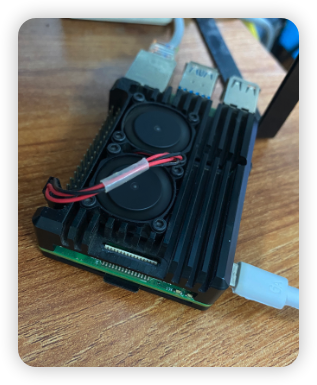

[🇨🇳 中文文档](./README.md) | [🇺🇸 English](./README_EN.md)

<div align="center">

#  树莓派 OpenWrt 软路由配置指南

[](https://immortalwrt.org/) [](https://www.raspberrypi.org/) [](https://opensource.org/licenses/MIT)  [](https://raspi.ronchy2000.top/)

**从零开始，打造属于你的全屋智能网关**

在线文档入口：[Raspi ImmortalWrt Docs](https://raspi.ronchy2000.top/)



### 🎯 核心特性

🚀 **全屋科学上网** • 📱 **智能分流** • 🔒 **安全可靠** • ⚡ **高性能路由**

---

### 📚 快速导航

[🔥 快速开始](#烧录固件) • [⚙️ 初始配置](#初始配置) • [🌐 网络配置](#网络配置) • [🎨 功能扩展](#功能扩展) • [📖 完整文档](#常用设置及文档)

</div>

---

## 🌟 项目简介

> 💡 **编者按**：毕业后买了一块树莓派4B，装了Ubuntu学习linux的相关操作后，但很快就闲置了下来。偶然听说可以刷OpenWRT系统实现多播，以及当软路由科学上网用，于是又走上了一番折腾之路，在此记录下来。

本项目提供**完整的树莓派软路由配置方案**，从固件选择、系统烧录到高级功能配置，助你轻松打造一台功能强大的智能网关。

### ✨ 为什么选择 ImmortalWrt？

| 特性 | 官方 OpenWrt | ImmortalWrt |
|------|-------------|-------------|
| **插件数量** | 基础 | 🎯 丰富 |
| **CDN加速** | 无 | ✅ 支持 |
| **中文支持** | 一般 | ✅ 完善 |
| **更新频率** | 标准 | 🚀 活跃 |

**下文所述的 OpenWrt 均指 ImmortalWrt**


## 🎁 本项目提供什么？

<table>
  <tr>
    <td align="center">📝</td>
    <td><b>完整配置教程</b><br/>从零开始的详细步骤</td>
  </tr>
  <tr>
    <td align="center">🤖</td>
    <td><b>智能运维脚本</b><br/>自动监控、智能备份、故障自愈</td>
  </tr>
  <tr>
    <td align="center">📦</td>
    <td><b>常用工具集</b><br/>一键安装、备份恢复脚本</td>
  </tr>
</table>

---

# 常用设置及文档
1. 烧录工具及步骤：
  - 烧录软件及使用：[docs/Write_Image.md](docs/Write_Image.md)

2. 拨号设置
  - 上级路由 LAN 接入（新手推荐先看）：[docs/Lan_Connectioin.md](docs/Lan_Connectioin.md)
  - 家庭或校园网拨号：[docs/PPPoE_Connection.md](docs/PPPoE_Connection.md)

3. OpenWrt备份与恢复：
系统已升级为**智能备份**策略，仅在配置变更时触发备份，并自动记录变更详情。
  - 智能备份原理与配置：[docs/System_Maintenance.md#自动化监控](docs/System_Maintenance.md#自动化监控)
  - 手动备份与恢复：[docs/OpenWrt_Backup&Resotre.md](docs/OpenWrt_Backup&Resotre.md)
  - 旧版自动备份参考：[docs/OpenWrt_AutoBackup.md](docs/OpenWrt_AutoBackup.md)

4. **系统监控与维护** 🔥
  - 完整维护指南：[docs/System_Maintenance.md](docs/System_Maintenance.md)
  - 监控脚本说明：[scripts/README.md](scripts/README.md)
  - 快速参考：[系统监控与维护](#系统监控与维护)

5. 软件空间扩容
  - 扩容Overlay空间：[docs/ExtendOverlaySize.md](docs/ExtendOverlaySize.md)

6. Openclash科学上网设置
  - 科学上网插件配置：[docs/Openclash_Config.md](docs/Openclash_Config.md)
  - GitHub SSH 22 端口故障排查：[docs/GitHub_SSH_22_Port_Blocking.md](docs/GitHub_SSH_22_Port_Blocking.md)

---

# 前言

官方 OpenWrt 固件过于精简，因此我选择了功能更丰富的 `ImmortalWrt`，它提供了更多插件以及 CDN 加速源，大大提升了使用体验。本文记录了我在`树莓派4B`上配置 OpenWrt 软路由的完整过程，希望能帮助到有类似需求的朋友。
**下文所述的OpenWrt都是指ImmortalWrt**，可以把ImmortalWrt理解成功能更丰富的OpenWrt，但本身还是OpenWrt系统。
# 硬件环境

- 设备：Raspberry Pi 4B/400/CM4 (64bit)
- 系统版本：ImmortalWrt 24.10.3 r33451-5531f6bc76a3
- 架构：aarch64_cortex-a72 (bcm27xx/bcm2711)

```bash
# 确认当前版本/平台
cat /etc/openwrt_release; uname -m
# 输出示例：
# DISTRIB_ID='ImmortalWrt'
# DISTRIB_RELEASE='24.10.3'
# DISTRIB_REVISION='r33451-5531f6bc76a3'
# DISTRIB_TARGET='bcm27xx/bcm2711'
# DISTRIB_ARCH='aarch64_cortex-a72'
# DISTRIB_DESCRIPTION='ImmortalWrt 24.10.3 r33451-5531f6bc76a3'
# aarch64
```

<a id="firmware_selection_cn"></a>
## 固件选择

- 固件源：[ImmortalWrt Firmware Selector](https://firmware-selector.immortalwrt.org)
- 注意事项：
  - EXT4 版本会覆盖掉所有的用户设置 `覆盖写入(如果需要重新配置，请刷入此固件！)`
  - SQUASHFS 版本写入后，用户的配置不变。`增量写入`
具体固件包可以在release中找到。

# 烧录固件
> 详细步骤请见文档：[docs/Write_Image.md](docs/Write_Image.md)
- 烧录工具：
    - rufus(windows)：https://rufus.ie
    - etcher(windows/linux/macos)：https://etcher.balena.io/#download-etcher
    - diskgenius(windows)：https://www.diskgenius.cn/download.php
    - 微PE(windows)：https://www.wepe.com.cn/download.html
    - DiskImage(windows)：https://roadkil.net/download.php?FileID=409&ProgramID=12

- 注意事项：
  - 烧录前请先格式化 SD 卡
  - 烧录完成后，SD 卡会自动弹出
  - 烧录过程中，请勿移除 SD 卡

# 初始配置

## 连接到 OpenWrt
1. 无线连接，即ssh连接:（推荐）

  - i. 连接树莓派wifi（默认名称：`ImmortalWrt` ）
  - ii.浏览器输入`192.168.1.1`，进入后台，默认密码为空，直接点击确定。
  - iii.（与上方二选一） 使用本地ssh工具，address: `192.168.1.1`, 端口：`22`, Username: `root`, Password: `默认为空`/`编译固件时候的密码，请见`[固件选择](#firmware_selection_cn)


2. 有线连接：

  - i. 使用网线直连树莓派；
  - ii. 更改本地以太网 IPv4 地址为 `192.168.1.x` 网段， 子网掩码`255.255.255.0`;（末尾`x` 可以是2-255范围中的任意整数）,网关填写：`192.168.1.1`。

  <div align="center">
  
  </div>

  - iii. 访问 `192.168.1.1` 进入 OpenWrt 的web后台;
  - iv. 默认账户：root; 默认密码：(空)或烧录时设置的密码。
> `方法2`适用于复杂的校园网环境（尤其是同一个实验室中出现不同局域网的情况）


## 基础设置
> 连接后，第一步先修改密码。第二步关闭IPv6设置。

- 关闭 IPv6 相关设置（参考视频 24:42）https://www.youtube.com/watch?v=JfSJmPFiL_s&t=344s

# 网络配置
> 接下来需要配置网络，如果您将路由器lan口与树莓派的网口连接，那么不用做任何改动，连接到树莓派的wifi即可成功上网。
>
> 先选场景再操作（避免踩坑）：
> 1) 上级路由 LAN 接入（树莓派网口接上级路由 LAN 口）：看 [LAN 连接文档](docs/Lan_Connectioin.md)
> 2) 主路由/校园网拨号：看 [PPPoE 文档](docs/PPPoE_Connection.md)

<a id="simplest_method"></a>
## 最简单用法
将树莓派的单个网口连接到光猫或路由器的LAN口，此时任何终端设备连接上树莓派的wifi后，都可上网。
详细图文步骤见：[`docs/Lan_Connectioin.md`](docs/Lan_Connectioin.md)

> 但如果你是在校园网环境下，或者是想让树莓派当主路由器，即有拨号需求，请看以下方法。

## 单网口树莓派配置 WAN 和 LAN
> 详见：https://www.youtube.com/watch?v=pEf-MjqTFJ4&list=PLma6Xp9L8ZNkhKv2AFYMrwY4_Vb1J3uxG&index=2
<strong> 最初考虑使用 VLAN 技术实现单网口分离 WAN 和 LAN，但由于交换机不支持 VLAN，最终放弃这种方式。 </strong>
说人话：
由于树莓派只有单个网口，所以通过[最简单用法](#simplest_method)，只能做到其他设备只能通过wifi连接，不能再通过网线连接。如何能实现其他设备网线连接到树莓派？答：用一个有VLAN功能的交换机即可实现。（但我没有哈哈哈）

## 校园网拨号解决方案
> 如果要家庭拨号，那么此时的软路由做主路由。相关的拨号账户的获取，这里不再展开。请见[桥接模式的教程](https://github.com/Ronchy2000/Home-Network-Router-Bridging-Solution)。

校园网拨号较为复杂，可能会识别出设备类型导致连接失败。

具体拨号设置步骤请见：[docs/PPPoE_Connection.md](docs/PPPoE_Connection.md)

---
> 至此，你的全屋设备连接到树莓派wifi，都可以成功上网了！

> 接下来配置紧张刺激的科学上网插件，来实现全屋全球漫游！


# 功能扩展

## 主题美化

> 安装 cargo luci 主题，提升界面美观度（参考视频 33:12）https://www.youtube.com/watch?v=JfSJmPFiL_s&t=1992s

如果您自己会安装，请直接按照以下步骤操作：

`系统--软件包--更新列表--没有报错--安装luci-theme-argon--安装luci-i18n-ttyd-zh-cn`

插件安装：
- luci-app-openclash
- luci-i18n-passwall-zh-cn
- luci-i18n-homeproxy-zh-cn
- luci-i18n-quickstart-zh-cn
- iStore 商店（通过 imm.sh 安装）

插件位置在：侧边栏的“服务”标签页。

命令行安装（ARM64 & x86-64 通用）：
```bash
# 安装 iStore 商店
wget -qO imm.sh https://cafe.cpolar.cn/wkdaily/zero3/raw/branch/main/zero3/imm.sh && chmod +x imm.sh && ./imm.sh

# 安装 quickstart 网络向导和首页
is-opkg install luci-i18n-quickstart-zh-cn
```

> 插件安装好了，接下来只要完成最后一步，配置代理工具，之后您就可以在全屋的任意终端设备上实现`科 学 上 网`了！
## 科学上网配置
> 说实话，折腾软路由到现在，不就是为了这一刻嘛？
> 当你真正配置好科学上网，看着全屋设备都能自由、快速地访问外网，那一瞬间的畅快，绝对是所有折腾的意义所在。

> 有人说，科学上网只是个工具，我每个设备都安装上代理工具不就行了？但对折腾党来说，要做到优雅的科学上网太值得去花费精力了。从节点选择、DNS分流到透明代理，每一步都暗藏玄机。配得好，你的网络能像丝一样顺滑；配不好，整天都在“连不上”“打不开”的循环里。

> 接下来，就让我们配置openclash，看看怎么让 OpenWrt 的软路由真正“飞”起来。

1. 安装科学上网插件Openclash等
根据个人喜好下载添加即可（不能同时使用！）
- Openclash （强烈推荐，用的人最多，本文教程也是基于此）
- passWall
- 略

>安装好 OpenClash 插件后，先看一遍这段视频，按步骤完成基础配置即可：
链接：https://www.youtube.com/watch?v=1U9xkpexHOE

与视频不同的是，视频里的 `config.yaml` 在实际使用中会出现两个问题：一是 `LinkedIn`无法正常访问，二是像 IEEE 这类`学术网站`无法正确识别学术网络的 IP，导致需要频繁切换网络才能下载文献。本文提供的配置方案针对规则与 DNS 分流做了调整，解决了上述问题，并给出可复现的示例与验证步骤。

请使用[config_linkedin.yaml](config.yaml)作为配置文件。

本配置说明：文献库，steam下载走直连，linkedin利用海外DNS访问，防止跳转回国，更多功能请提PR！

<div align="center">
  
</div>


2. 高级使用方法
自定义规则添加：

- [OpenClash 维护指南.](https://blog.dreamtobe.cn/openclash_maintain/)
- [自定义 OpenClash 规则.](https://github.com/Aethersailor/Custom_OpenClash_Rules) 配置成功！
- [GitHub 访问优化.](https://github.com/521xueweihan/GitHub520)
    - 添加 GitHub 相关域名到直连规则.
    - 通过修改本地 hosts 文件解决 GitHub 访问速度慢和图片显示不出来的问题.

# 参考资料
[https://www.youtube.com/watch?v=s84CWgKus4U&t=105s](https://www.youtube.com/watch?v=s84CWgKus4U&t=105s)

# 总结

通过以上配置，成功将树莓派打造成了一台功能强大的软路由，解决了校园网环境下的网络连接问题，并实现了科学上网等高级功能。ImmortalWrt 相比官方 OpenWrt 提供了更丰富的插件支持，大大提升了使用体验。

希望这份配置指南能对你有所帮助！如有问题，欢迎在评论区交流讨论。

# 系统监控与维护

> 📚 **完整文档**: [System_Maintenance.md](docs/System_Maintenance.md) | 🛠️ **脚本说明**: [scripts/README.md](scripts/README.md)

系统已配置完善的自动化监控，确保稳定运行。

## 监控概览

| 监控项目 | 频率 | 脚本 | 功能 |
|---------|------|------|------|
| 🏥 健康检查 | 每30分钟 | `health_monitor.sh` | 内存/服务/连接数监控，异常自动处理 |
| 👁️ LuCI看门狗 | 每5分钟 | `luci_watchdog.sh` | Web界面自动修复 |
| 💾 系统备份 | 每天15:00 | `smart_backup.sh` | 智能按需备份 (本地3份+远程30天) |
| 🔄 OpenClash更新 | 每周 | 官方脚本 | 规则/IP库/GeoData自动更新 |

## 快速命令

```bash
# 查看系统状态
ssh root@192.168.1.1 "uptime && free -h && df -h"

# 查看监控日志
ssh root@192.168.1.1 "tail -50 /root/health_monitor.log"

# 手动触发备份
ssh root@192.168.1.1 "/root/smart_backup.sh"

# 重启服务
ssh root@192.168.1.1 "/etc/init.d/openclash restart"
ssh root@192.168.1.1 "/etc/init.d/uhttpd restart"
```

## 常见问题

<details>
<summary><b>❌ haproxy 崩溃循环</b> (系统日志: "haproxy is in a crash loop")</summary>

**原因**: haproxy 配置的后端服务器不存在

**解决**:
```bash
ssh root@192.168.1.1 "/etc/init.d/haproxy stop && /etc/init.d/haproxy disable"
```
</details>

<details>
<summary><b>🌐 WiFi连接但无网络</b></summary>

```bash
ssh root@192.168.1.1 "/etc/init.d/openclash restart"
```
</details>

<details>
<summary><b>💻 LuCI 无法访问</b></summary>

```bash
ssh root@192.168.1.1 "/etc/init.d/uhttpd restart"
```

查看LuCI看门狗日志：
```bash
ssh root@192.168.1.1 "tail -20 /root/luci_watchdog.log"
```
</details>

<details>
<summary><b>💿 SD卡寿命担忧</b></summary>

系统已优化：
- 每天写入: ~65MB
- 年写入量: ~24GB (仅占SD卡容量75%)
- 预计寿命: 13.5年+ (远超5年目标) ✅

详见: [System_Maintenance.md#SD卡寿命优化](docs/System_Maintenance.md#sd卡寿命优化)
</details>

## 部署监控脚本

如需在新系统部署监控脚本，使用项目中的脚本：

```bash
# 从项目目录执行
cd Raspi-ImmortalWrt/scripts

# 复制脚本到路由器
scp health_monitor.sh luci_watchdog.sh smart_backup.sh root@192.168.1.1:/root/

# 设置权限并配置定时任务
ssh root@192.168.1.1 << 'EOF'
chmod +x /root/*.sh
crontab -l | grep -v "health_monitor\|luci_watchdog\|smart_backup" > /tmp/cron.tmp
cat >> /tmp/cron.tmp << 'CRON'
*/30 * * * * /root/health_monitor.sh
*/5 * * * * /root/luci_watchdog.sh
0 15 * * * /root/smart_backup.sh >> /root/smart_backup.log 2>&1
CRON
crontab /tmp/cron.tmp && rm /tmp/cron.tmp
echo "✅ 监控脚本已部署"
EOF
```

详见: [scripts/README.md](scripts/README.md)

---

## 软件空间扩容
- 扩容Overlay空间：[docs/ExtendOverlaySize.md](docs/ExtendOverlaySize.md)


<p align="center">
  <em> ❤️ 感谢您的关注!</em><br><br>
  
</p>
