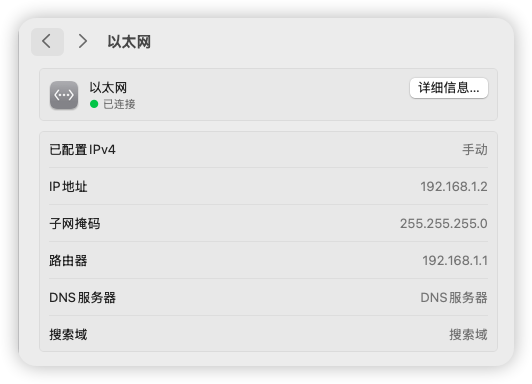
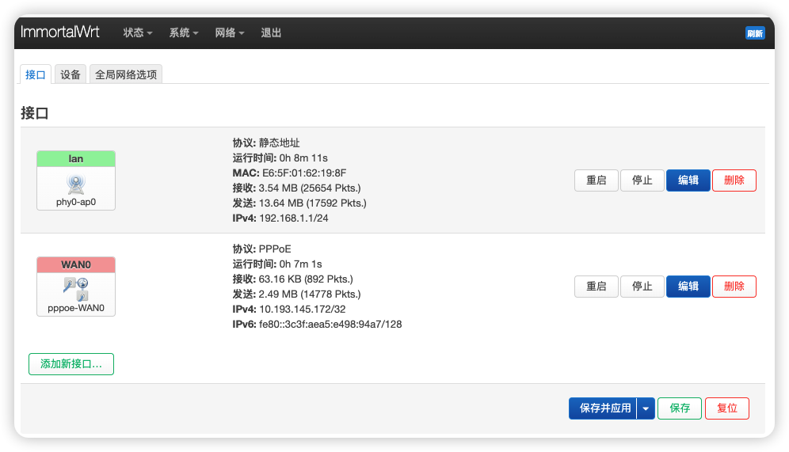

# 树莓派 OpenWrt 软路由配置指南

## 前言

官方 OpenWrt 固件过于精简，因此我选择了功能更丰富的 ImmortalWrt，它提供了更多插件以及 CDN 加速源，大大提升了使用体验。本文记录了我在树莓派上配置 OpenWrt 软路由的完整过程，希望能帮助到有类似需求的朋友。

## 硬件环境

- 设备：Raspberry Pi 4B/400/CM4 (64bit)

## 固件选择

- 固件源：ImmortalWrt Firmware Selector
- 注意事项：
  - EXT4 版本会覆盖掉所有的设置
  - SQUASHFS 版本写入后，用户的配置不变
具体固件包可以在release中找到。

## 烧录固件
- 烧录工具：
    - rufus(windows)：https://rufus.ie
    - etcher(windows/linux/macos)：https://etcher.balena.io/#download-etcher
    - diskgenius(windows)：https://www.diskgenius.cn/download.php
    - 微PE(windows)：https://www.wepe.com.cn/download.html
    - DiskImage(windows)：https://roadkil.net/download.php?FileID=409&ProgramID=12

- 注意事项：
  - 烧录前请先格式化 SD 卡
  - 烧录完成后，SD 卡会自动弹出
  - 烧录过程中，请勿移除 SD 卡

## 初始配置

### 连接到 OpenWrt

1. 使用网线直连树莓派
2. 更改本地以太网 IPv4 地址为 192.168.1.x 网段， 子网掩码255.255.255.0
3. 访问 192.168.1.1 进入 OpenWrt 后台

> 此方法适用于最简单以及复杂的校园网环境（尤其是同一个实验室中出现不同局域网的情况）

  

### 基础设置

- 默认账户：root
- 默认密码：  （空）
- 关闭 IPv6 相关设置（参考视频 24:42）https://www.youtube.com/watch?v=JfSJmPFiL_s&t=344s

## 网络配置

### 单网口树莓派配置 WAN 和 LAN

<strong> 最初考虑使用 VLAN 技术实现单网口分离 WAN 和 LAN，但由于交换机不支持 VLAN，最终放弃这种方式。 </strong>

### 校园网拨号解决方案

校园网拨号较为复杂，可能会识别出设备类型导致连接失败。

  

解决方法：

1. 新建 WAN0 接口，配置拨号账户
2. LAN 设置：将设备改为无线网络
3. 如遇问题，请将 WiFi 放置在最高优先级后再测试！

  

  

## 功能扩展

### 主题美化

安装 cargo luci 主题，提升界面美观度（参考视频 33:12）https://www.youtube.com/watch?v=JfSJmPFiL_s&t=344s 

### 科学上网配置

1. 安装科学上网插件
> 根据个人喜好下载添加即可（不能重复同时使用！）
- Openclash
- passWall
- 略

2. 自定义规则添加：
   - [OpenClash 维护指南](https://blog.dreamtobe.cn/openclash_maintain/)
   - [自定义 OpenClash 规则](https://github.com/Aethersailor/Custom_OpenClash_Rules)

## 参考资料

- [不良林 OpenWrt 视频教程](https://www.youtube.com/watch?v=JfSJmPFiL_s)
- [不良林 OpenWrt 文字教程](https://bulianglin.com/archives/openwrt.html)
- [树莓派安装 OpenWrt 作为主路由及解决校园网登录问题](https://www.bilibili.com/video/xxx)

## 总结

通过以上配置，成功将树莓派打造成了一台功能强大的软路由，解决了校园网环境下的网络连接问题，并实现了科学上网等高级功能。ImmortalWrt 相比官方 OpenWrt 提供了更丰富的插件支持，大大提升了使用体验。

希望这份配置指南能对你有所帮助！如有问题，欢迎在评论区交流讨论。