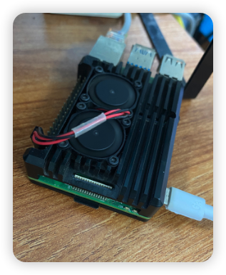
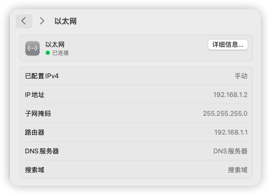

[🇨🇳 中文文档](./README.md) | [🇺🇸 English](./README_EN.md)

#  Raspberry Pi OpenWrt Software Router Configuration Guide

    

**Transform Your Raspberry Pi into a Smart Gateway**

Docs Portal: [Raspi ImmortalWrt Docs](https://raspi.ronchy2000.top/)

### 🎯 Core Features

🚀 **Whole-Home Network Access** • 📱 **Intelligent Traffic Routing** • 🔒 **Secure & Reliable** • ⚡ **High Performance**

---

### 📚 Quick Navigation

[🔥 Quick Start](#flashing-the-firmware) • [⚙️ Initial Setup](#initial-configuration) • [🌐 Network Config](#network-configuration) • [🎨 Extensions](#feature-extensions) • [📖 Full Documentation](#common-settings-and-documentation)

---

## 🌟 Project Introduction

> 💡 **Editor's Note**: After graduation, I bought a Raspberry Pi 4B and installed Ubuntu to learn Linux operations, but it soon became idle. By chance, I heard that it could be flashed with OpenWRT system to achieve multicast and serve as a software router for network access, so I embarked on another journey of tinkering, which I document here.

This project provides a **complete Raspberry Pi software router configuration solution**, from firmware selection and system flashing to advanced feature configuration, helping you easily build a powerful smart gateway.

### ✨ Why Choose ImmortalWrt?

| Feature | Official OpenWrt | ImmortalWrt |
|---------|------------------|-------------|
| **Plugin Quantity** | Basic | 🎯 Rich |
| **CDN Acceleration** | None | ✅ Supported |
| **Chinese Support** | Average | ✅ Excellent |
| **Update Frequency** | Standard | 🚀 Active |

**All references to OpenWrt below refer to ImmortalWrt**

---

## 🎁 What This Project Offers

<table>
  <tr>
    <td align="center">📝</td>
    <td><b>Complete Configuration Guide</b> Detailed step-by-step instructions</td>
    <td align="center">🛠️</td>
    <td><b>Practical Toolset</b> Flashing, backup, expansion tools</td>
  </tr>
  <tr>
    <td align="center">🌐</td>
    <td><b>Network Access Solution</b> Optimized OpenClash configuration</td>
    <td align="center">📊</td>
    <td><b>Automation Scripts</b> One-click backup and updates</td>
  </tr>
</table>

---

# Common Settings and Documentation:
1. Flashing Tools and Steps:
  - Flashing Software and Usage: [docs/Write_Image.md](docs/Write_Image.md)

2. Dial-up Settings
  - LAN Uplink to Upstream Router (beginner-friendly): [docs/Lan_Connectioin.md](docs/Lan_Connectioin.md)
  - Home or Campus Network Dial-up: [docs/PPPoE_Connection.md](docs/PPPoE_Connection.md)

3. OpenWrt Backup & Restore:
If you have backup and restore needs:
  - Manual Backup & Restore: [docs/OpenWrt_Backup_Resotre.md](docs/OpenWrt_Backup_Resotre.md)

  - Legacy GitHub Auto Backup Reference: [docs/OpenWrt_AutoBackup.md](docs/OpenWrt_AutoBackup.md)

4. Software Space Expansion
  - Identify the system type first, then choose the path: [docs/Storage_Expansion_Guide.md](docs/Storage_Expansion_Guide.md)
  - Advanced path for `squashfs + overlay` only: [docs/ExtendOverlaySize.md](docs/ExtendOverlaySize.md)

5. OpenClash Network Access Settings
  - Network Access Plugin Configuration (`opkg` / `apk` split covered): [docs/Openclash_Config.md](docs/Openclash_Config.md)
  - GitHub SSH Port 22 Troubleshooting: [docs/en/GitHub_SSH_22_Port_Blocking.md](docs/en/GitHub_SSH_22_Port_Blocking.md)

---

# Preface

The official OpenWrt firmware is too minimalistic, so I chose the feature-rich `ImmortalWrt`, which provides more plugins and CDN acceleration sources, greatly enhancing the user experience. This article documents my complete process of configuring an OpenWrt software router on a `Raspberry Pi 4B`, hoping to help others with similar needs.

**All references to OpenWrt below refer to ImmortalWrt**. You can understand ImmortalWrt as a more feature-rich OpenWrt, but it is still essentially an OpenWrt system.

# Hardware Environment

- Device: Raspberry Pi 4B/400/CM4 (64bit)

## Firmware Selection

- Firmware Source: [ImmortalWrt Firmware Selector](https://firmware-selector.immortalwrt.org)
- Important Notes:
  - EXT4 version will overwrite all user settings `(Overwrite mode - flash this firmware if you need to reconfigure!)`
  - SQUASHFS version preserves user configurations after flashing `(Incremental mode)`

Specific firmware packages can be found in the release section.

# Flashing the Firmware
> For detailed steps, see documentation: [docs/Write_Image.md](docs/Write_Image.md)

- Flashing Tools:
    - rufus (Windows): https://rufus.ie
    - etcher (Windows/Linux/macOS): https://etcher.balena.io/#download-etcher
    - diskgenius (Windows): https://www.diskgenius.cn/download.php
    - WePE (Windows): https://www.wepe.com.cn/download.html
    - DiskImage (Windows): https://roadkil.net/download.php?FileID=409&ProgramID=12

- Important Notes:
  - Format the SD card before flashing
  - The SD card will automatically eject after flashing is complete
  - Do not remove the SD card during the flashing process

# Initial Configuration

## Connecting to OpenWrt

**Method 1: Wireless Connection (SSH) - Recommended**

  - i. Connect to Raspberry Pi WiFi (default name: `ImmortalWrt`)
  - ii. Enter `192.168.1.1` in your browser to access the admin panel, default password is empty, just click confirm
  - ii. (Alternative) Use local SSH tool, address: `192.168.1.1`, port: `22`, Username: `root`, Password: `empty by default` / `password set during firmware compilation, see` [Firmware Selection](#firmware_selection_en)

**Method 2: Wired Connection**

  - i. Connect directly to the Raspberry Pi with an Ethernet cable
  - ii. Change your local Ethernet IPv4 address to the `192.168.1.x` subnet with subnet mask `255.255.255.0` (the last `x` can be any integer from 2-255), set gateway to `192.168.1.1`

  

  
  

  - iii. Access `192.168.1.1` to enter the OpenWrt web admin panel
  - iv. Default username: root; Default password: (empty) or the password set during flashing

> `Method 2` is suitable for complex campus network environments (especially when different LANs exist in the same laboratory)

## Basic Settings
> After connecting, first change the password. Second, disable IPv6 settings.

- Disable IPv6 related settings (refer to video at 24:42) https://www.youtube.com/watch?v=JfSJmPFiL_s&t=344s

# Network Configuration
> Next, you need to configure the network. If you connect the router's LAN port to the Raspberry Pi's network port, you don't need to make any changes - simply connect to the Raspberry Pi's WiFi to access the internet.
>
> Choose your scenario first (to avoid common mistakes):
> 1) Upstream router LAN uplink (Pi Ethernet -> upstream router LAN): read [LAN Connection](docs/Lan_Connectioin.md)
> 2) Main router / campus PPPoE: read [PPPoE guide](docs/PPPoE_Connection.md)

### Simplest Usage
Connect the Raspberry Pi's single network port to the LAN port of your optical modem or router. Any terminal device connected to the Raspberry Pi's WiFi can then access the internet.
Step-by-step screenshots: [`docs/Lan_Connectioin.md`](docs/Lan_Connectioin.md)

> However, if you're in a campus network environment or want the Raspberry Pi to act as the main router (i.e., you have dial-up requirements), please see the following methods.

## Single Network Port Raspberry Pi WAN and LAN Configuration
> For details, see: https://www.youtube.com/watch?v=pEf-MjqTFJ4&list=PLma6Xp9L8ZNkhKv2AFYMrwY4_Vb1J3uxG&index=2

<strong>Initially considered using VLAN technology to separate WAN and LAN on a single port, but ultimately abandoned this approach as the switch did not support VLAN.</strong>

In plain language:
Since the Raspberry Pi has only a single network port, using the [simplest method](#simplest_method_en), other devices can only connect via WiFi, not through Ethernet cable. How can you enable other devices to connect to the Raspberry Pi via Ethernet? Answer: Use a switch with VLAN functionality (but I don't have one, haha).

## Campus Network Dial-up Solution
> For home dial-up, the software router acts as the main router. Related dial-up account acquisition is not covered here. Please see [Bridging Mode Tutorial](https://github.com/Ronchy2000/Home-Network-Router-Bridging-Solution).

Campus network dial-up is more complex and may fail due to device type detection.

For specific dial-up configuration steps, see: [docs/PPPoE_Connection.md](docs/PPPoE_Connection.md)

---
> At this point, all devices in your home connected to the Raspberry Pi WiFi can successfully access the internet!

> Next, let's configure the exciting network access plugins to achieve whole-home global internet access!

# Feature Extensions

## Theme Customization

> Install cargo luci theme to enhance interface aesthetics (refer to video at 33:12) https://www.youtube.com/watch?v=JfSJmPFiL_s&t=1992s

If you already know the LuCI package page, you can install themes and plugins there directly.

Keep in mind that package management is now split by OpenWrt version:

- `24.10 and earlier stable releases`: `opkg`
- `25.12 and newer`: `apk`

`System--Software Packages--Update Lists--No errors--Install luci-theme-argon--Install luci-i18n-ttyd-zh-cn`

Plugin Installation:
- luci-app-openclash
- luci-i18n-passwall-zh-cn
- luci-i18n-homeproxy-zh-cn
- luci-i18n-quickstart-zh-cn
- iStore App Store (installed via imm.sh)

Plugin location: In the "Services" tab on the sidebar.

Before using command-line or third-party installer scripts, confirm whether your system uses `opkg` or `apk`. Do not blindly reuse older commands.

> Once plugins are installed, complete the final step of configuring the proxy tool, and you'll be able to achieve `network access` on any terminal device in your home!

## Network Access Configuration
The OpenClash guide has been restructured into a version-aware manual covering both:

- `OpenWrt 24.10 and earlier stable releases`: `opkg`
- `OpenWrt 25.12 and newer`: `apk`

The repository currently provides four YAML variants:

- [config.yaml](config.yaml): base template
- [config_linkedin.yaml](config_linkedin.yaml): LinkedIn fix
- [config_linkedin_auto.yaml](config_linkedin_auto.yaml): recommended smart-switch version
- [config_linkedin_auto_ssh22_redir.yaml](config_linkedin_auto_ssh22_redir.yaml): GitHub SSH 22 compatibility variant

Read the updated guide here: [docs/Openclash_Config.md](docs/Openclash_Config.md)

The new guide explains:

- how to identify whether your system should use `opkg` or `apk`
- how to choose the right YAML
- why `config_linkedin_auto.yaml` is the best default for most users
- why many academic sites should stay on direct routing
- where to add your own direct or proxy rules

# References
[https://www.youtube.com/watch?v=s84CWgKus4U&t=105s](https://www.youtube.com/watch?v=s84CWgKus4U&t=105s)

# Conclusion

Through the above configuration, I successfully transformed a Raspberry Pi into a powerful software router, solving network connection issues in campus environments and implementing advanced features like network access. ImmortalWrt provides richer plugin support compared to official OpenWrt, greatly enhancing the user experience.

I hope this configuration guide helps you! If you have any questions, feel free to discuss in the comments section.

# Other
## OpenWrt Backup & Restore:
If you have backup and restore needs:
- Manual Backup & Restore: [docs/OpenWrt_Backup_Resotre.md](docs/OpenWrt_Backup_Resotre.md)

- Scheduled Automatic Backup Settings: [docs/OpenWrt_AutoBackup.md](docs/OpenWrt_AutoBackup.md)

## Software Space Expansion
- Expand Overlay Space: [docs/ExtendOverlaySize.md](docs/ExtendOverlaySize.md)

  <em> ❤️ Thanks for visiting!</em>  
  

