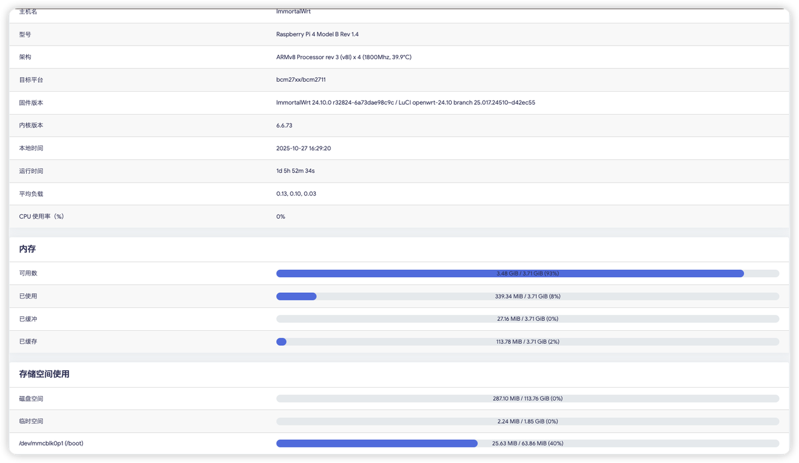
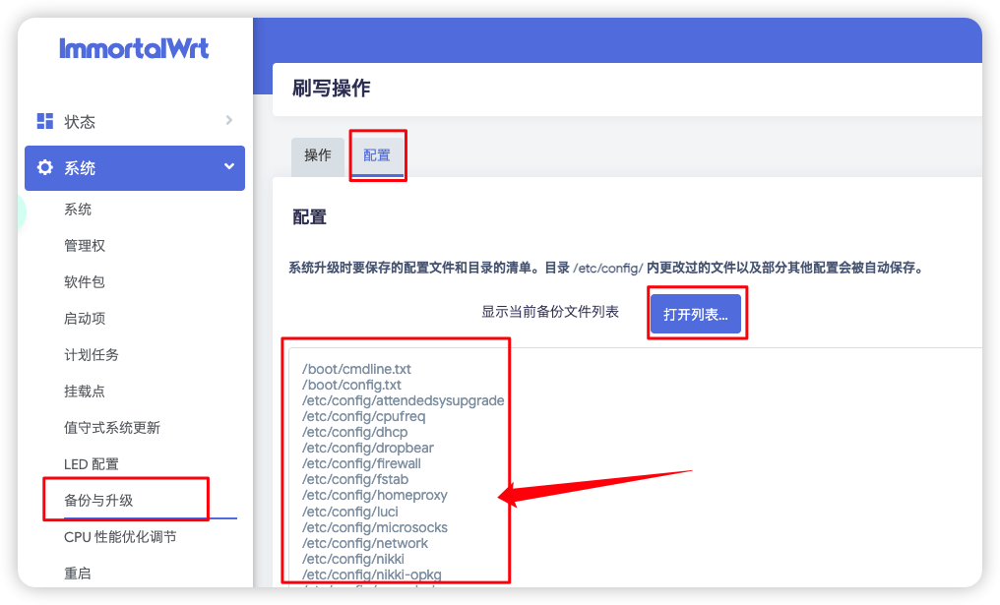
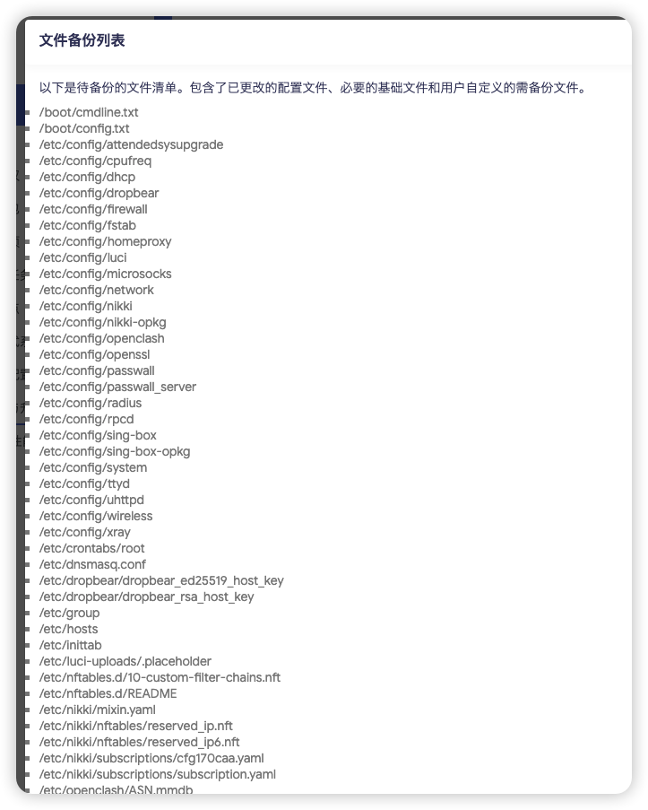
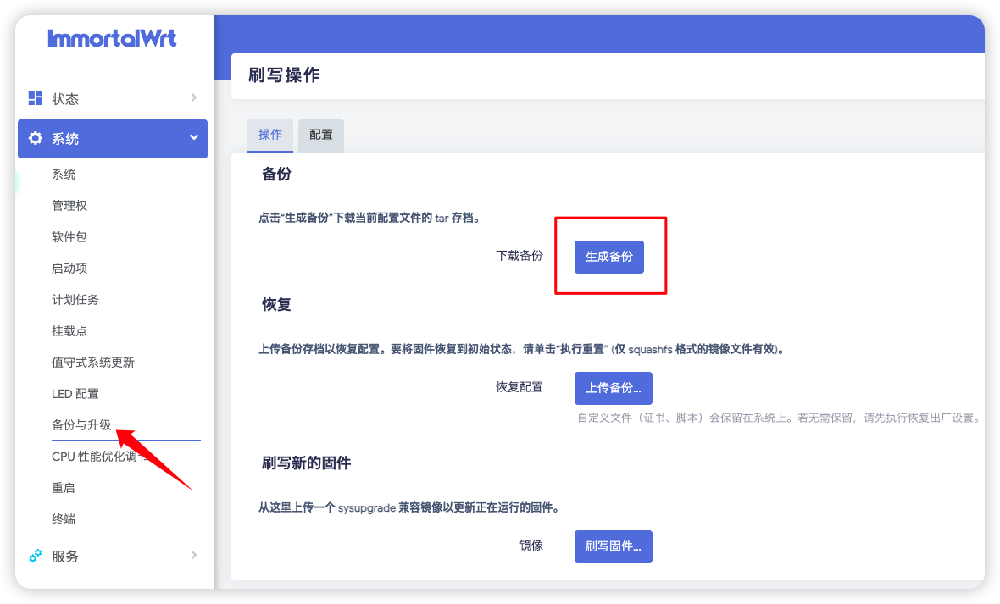
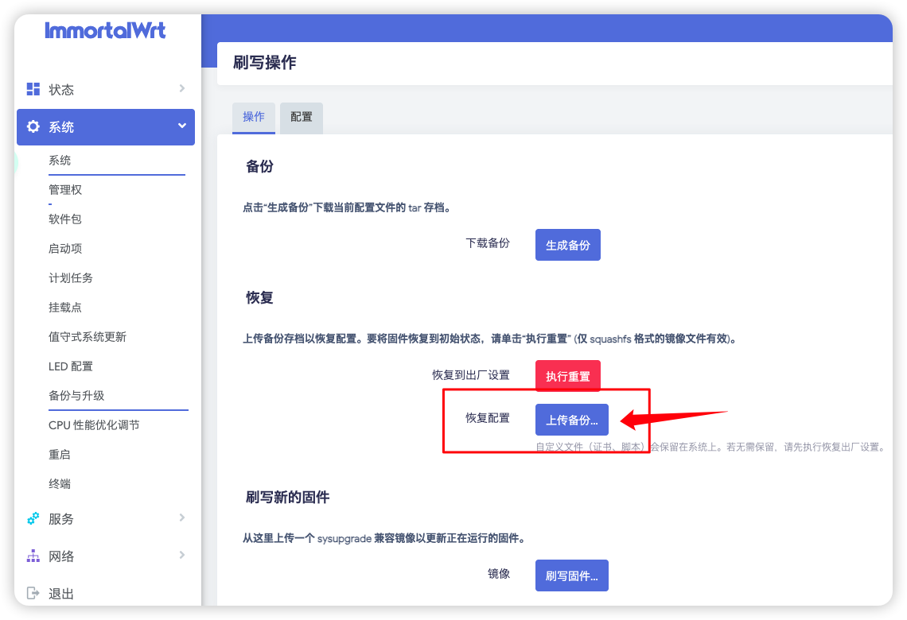

<a id="chinese"></a>
[🇨🇳 中文文档](#chinese) | [🇺🇸 English](#english)

# 备份与恢复
> 由于题主的SD卡是128GB，全部挂载到了Openwrt系统上，但整个系统一共消耗的资源只有287MB，有点大材小用了。遂计划备份后换到一个4GB的内存卡上。



## 备份

1. 前往系统设置填写`备份列表`。



2. 在`系统 -> 备份与升级 -> 生成备份`
备份系统相关配置：（保存文件到本地）

如果备份文件只有170B那么这个大小一定是出错了！请把你的IDM或者NDM插件关掉，用浏览器默认下载。

备份结束。

> 如果在系统设置中导出了备份，那么openclash也会被包含在备份中；以下仅为单独备份插件的方式。（可以不用）
备份openclash相关配置：（保存文件到本地


备份结束。

## 恢复

拿出新卡 or U盘
### 烧录固件
烧录树莓派相关的版本的固件。请见Openwrt[固件选择](../README.md#firmware_selection_cn)以及[烧录教程](./Write_Image.md)

### 恢复备份

<strong>重要：如果您不执行以以下操作，直接从`备份与恢复`设置`上传备份`，会报错！且难以解决！最好的方式就是新系统自行安装好插件，再进行备份文件上传。</strong>

烧录固件后，请先配置好网络，即，openwrt能够更新软件包，并安装相关内容如下；
> 安装 cargo luci 主题，提升界面美观度（参考视频 33:12）https://www.youtube.com/watch?v=JfSJmPFiL_s&t=1992s

先判断系统版本：

- `OpenWrt 24.10 及更早稳定版`：使用 `opkg`
- `OpenWrt 25.12 及更新版本 / 新分支`：使用 `apk`

如果你只想尽快恢复系统，优先使用 LuCI 网页里的“软件包”页面搜索安装所需主题和插件，不必强行照抄旧脚本。

如果您自己会安装，请直接按照以下步骤操作：

`系统--软件包--更新列表--没有报错--安装luci-theme-argon--安装luci-i18n-ttyd-zh-cn`

插件安装：
- luci-app-openclash
- luci-i18n-passwall-zh-cn
- luci-i18n-homeproxy-zh-cn
- luci-i18n-quickstart-zh-cn

插件位置在：侧边栏的“服务”标签页。

如果你偏好命令行，可按系统版本执行：

```bash
# OpenWrt 24.10 及更早稳定版
opkg update
opkg install luci-theme-argon luci-app-openclash luci-i18n-passwall-zh-cn luci-i18n-homeproxy-zh-cn luci-i18n-quickstart-zh-cn

# OpenWrt 25.12 及更新版本 / 新分支
apk update
apk add luci-theme-argon luci-app-openclash luci-i18n-passwall-zh-cn luci-i18n-homeproxy-zh-cn luci-i18n-quickstart-zh-cn
```

`imm.sh`、`is-opkg` 这类第三方安装脚本更容易受版本切换影响。
如果你当前是 `25.12+`，先确认脚本作者是否已经适配 `apk`，不要默认把它们当成恢复前置步骤。

重要：如果您不执行<strong>以上操作</strong>，直接从`备份与恢复`设置`上传备份`，会报错！且难以解决！

安装好插件后，去系统设置中上传备份：




恢复结束。可以退出本文档了！

如果您是命令行选手，那么请跟我来。
---


### 命令行备份及恢复。

1. 给openwrt安装sftp服务：
```bash
# OpenWrt 24.10 及更早稳定版
opkg update
opkg install openssh-sftp-server

# OpenWrt 25.12 及更新版本 / 新分支
apk update
apk add openssh-sftp-server
```
2. 安装`luci-theme-argon`后，在系统--备份与升级--上传备份。
3. 安装插件（恢复前建议至少安装以下内容）：
```bash
# OpenWrt 24.10 及更早稳定版
opkg install luci-app-openclash luci-i18n-passwall-zh-cn luci-i18n-homeproxy-zh-cn luci-i18n-quickstart-zh-cn

# OpenWrt 25.12 及更新版本 / 新分支
apk add luci-app-openclash luci-i18n-passwall-zh-cn luci-i18n-homeproxy-zh-cn luci-i18n-quickstart-zh-cn
```
4. 还原文件openclash配置(经实验，这个可以不用，openclash相关备份已经包含在系统备份中)

成功！

---

## 从 GitHub Configs 恢复配置 (高级)

我们的智能备份脚本 (`smart_backup.sh`) 除了生成 `.tar.gz` 压缩包外，还会将 `/etc/config/` 下的配置文件解压到 GitHub 仓库的 `configs/` 目录中。

这有什么用？
- **版本对比**: 你可以在 GitHub 上直接看到每次备份改了什么参数。
- **单文件恢复**: 如果你只改坏了一个配置（比如 `network`），不需要回滚整个系统，只需恢复这一个文件。

### 场景 1: 恢复单个配置文件

假设你把网络设置 (`/etc/config/network`) 改坏了，导致连不上网，或者配置错乱。

1. **在 GitHub 上找到文件**:
   - 打开你的备份仓库。
   - 进入 `configs/` 目录。
   - 找到 `network` 文件。
   - 点击 "Raw" 按钮，复制内容。

2. **在路由器上恢复**:
   - SSH 登录路由器。
   - 编辑文件并粘贴内容：
     ```bash
     vi /etc/config/network
     # 按 dG 删除所有内容
     # 按 i 进入插入模式
     # 粘贴 GitHub 上的内容
     # 按 Esc，输入 :wq 保存退出
     ```
   - 或者直接用 `cat` 覆盖 (如果你能复制粘贴)：
     ```bash
     cat > /etc/config/network <<EOF
     # 在这里粘贴内容
     EOF
     ```

3. **应用更改**:
   ```bash
   /etc/init.d/network restart
   ```

### 场景 2: 批量恢复所有配置

如果你想把整个 `/etc/config` 目录回滚到 GitHub 上的某个版本：

1. **进入备份目录**:
   ```bash
   cd /root/immortalwrt-backup
   ```

2. **拉取最新代码**:
   ```bash
   git pull origin master
   ```

3. **覆盖系统配置**:
   ```bash
   # 警告：这将覆盖你当前所有的系统设置！
   cp -r configs/* /etc/config/
   ```

4. **重启相关服务或系统**:
   ```bash
   reboot
   ```

---

<a id="english"></a>
[🇨🇳 中文文档](#chinese) | [🇺🇸 English](#english)

# Backup and Restore

> Since the author's SD card is 128GB, all mounted to the OpenWrt system, but the entire system only consumes 287MB of resources, which is a bit overkill. Therefore, the plan is to backup and switch to a 4GB memory card.


## Backup

1. Go to system settings and fill in the `Backup List`.


2. In `System -> Backup & Upgrade -> Generate Backup`
Backup system-related configurations: (Save file to local)

If the backup file is only 170B, this size definitely indicates an error! Please turn off your IDM or NDM plugin and use the browser's default download.

Backup complete.

> If you exported the backup in system settings, OpenClash will also be included in the backup; the following is just a separate plugin backup method. (Optional)
Backup OpenClash-related configurations: (Save file to local)


Backup complete.

## Restore

Take out new card or USB drive.

### Flash Firmware
Flash the Raspberry Pi related version firmware. Please see OpenWrt [Firmware Selection](../README.md#firmware_selection_en) and [Flashing Tutorial](./Write_Image.md)

### Restore Backup

<strong>Important: If you do not perform the following operations and directly upload the backup from `Backup & Restore` settings, it will report errors! And it's difficult to resolve! The best way is to install plugins on the new system first, then upload the backup file.</strong>

After flashing the firmware, please configure the network first, i.e., OpenWrt can update software packages, and install the following content:
> Install cargo luci theme to enhance interface aesthetics (refer to video at 33:12) https://www.youtube.com/watch?v=JfSJmPFiL_s&t=1992s

First identify your OpenWrt branch:

- `OpenWrt 24.10 and earlier stable releases`: use `opkg`
- `OpenWrt 25.12 and newer`: use `apk`

If your goal is only to restore the system cleanly, the safest default is to use the LuCI package page to install the required theme and plugins before importing the backup.

If you know how to install it yourself, follow these steps directly:

`System--Software Packages--Update Lists--No errors--Install luci-theme-argon--Install luci-i18n-ttyd-zh-cn`

Plugin Installation:
- luci-app-openclash
- luci-i18n-passwall-zh-cn
- luci-i18n-homeproxy-zh-cn
- luci-i18n-quickstart-zh-cn

Plugin location: In the "Services" tab on the sidebar.

If you prefer the command line, use the package manager that matches your system:

```bash
# OpenWrt 24.10 and earlier stable releases
opkg update
opkg install luci-theme-argon luci-app-openclash luci-i18n-passwall-zh-cn luci-i18n-homeproxy-zh-cn luci-i18n-quickstart-zh-cn

# OpenWrt 25.12 and newer
apk update
apk add luci-theme-argon luci-app-openclash luci-i18n-passwall-zh-cn luci-i18n-homeproxy-zh-cn luci-i18n-quickstart-zh-cn
```

Third-party installer wrappers such as `imm.sh` or `is-opkg` may lag behind the `opkg -> apk` transition. On `25.12+`, verify compatibility first instead of treating them as the default restore path.

Important: If you do not perform the <strong>above operations</strong> and directly upload the backup from `Backup & Restore` settings, it will report errors! And it's difficult to resolve!

After installing the plugins, go to system settings to upload the backup:


Restore complete. You can exit this document now!

If you are a command-line user, please follow me.
---

### Command Line Backup and Restore

1. Install SFTP service for OpenWrt:
```bash
# OpenWrt 24.10 and earlier stable releases
opkg update
opkg install openssh-sftp-server

# OpenWrt 25.12 and newer
apk update
apk add openssh-sftp-server
```
2. After installing `luci-theme-argon`, go to System--Backup & Upgrade--Upload Backup.
3. Install plugins (recommended before restore):
```bash
# OpenWrt 24.10 and earlier stable releases
opkg install luci-app-openclash luci-i18n-passwall-zh-cn luci-i18n-homeproxy-zh-cn luci-i18n-quickstart-zh-cn

# OpenWrt 25.12 and newer
apk add luci-app-openclash luci-i18n-passwall-zh-cn luci-i18n-homeproxy-zh-cn luci-i18n-quickstart-zh-cn
```
4. Restore OpenClash configuration files (after testing, this is not necessary, OpenClash-related backup is already included in the system backup)

Success!

---
