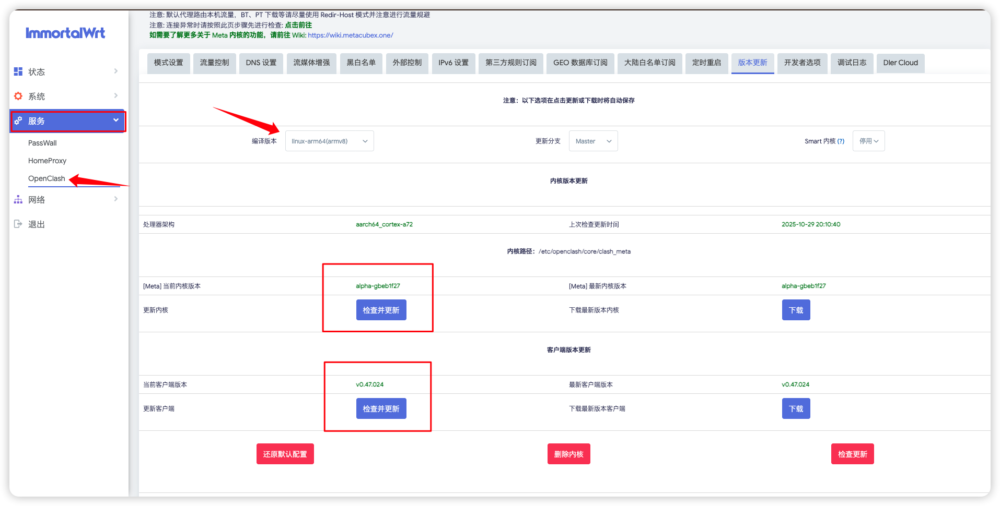
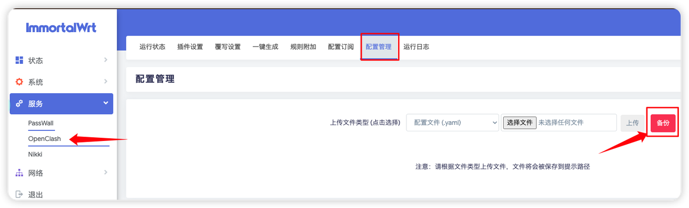

<a id="chinese"></a>
[🇨🇳 中文文档](#chinese) | [🇺🇸 English](#english)


> 具体配置细节还请见README文档中的Youtube视频，博主有空会直接配置好把固件发出来的。

### 科学上网配置
> 说实话，折腾软路由到现在，不就是为了这一刻嘛？
> 当你真正配置好科学上网，看着全屋设备都能自由、快速地访问外网，那一瞬间的畅快，绝对是所有折腾的意义所在。

> 接下来，就让我们配置openclash，看看怎么让 OpenWrt 的软路由真正“飞”起来。

1. 安装科学上网插件Openclash等
根据个人喜好下载添加即可（不能同时使用！）
- Openclash （强烈推荐，用的人最多，本文教程也是基于此）
- passWall
- 略

>安装好 OpenClash 插件后，先看一遍这段视频，按步骤完成基础配置即可：
链接：https://www.youtube.com/watch?v=1U9xkpexHOE

与视频不同的是，视频里的 `config.yaml` 在实际使用中会出现两个问题：一是 `LinkedIn`无法正常访问，二是像 IEEE 这类`学术网站`无法正确识别学术网络的 IP，导致需要频繁切换网络才能下载文献。本文提供的配置方案针对规则与 DNS 分流做了调整，解决了上述问题，并给出可复现的示例与验证步骤。

配置文件选择（均在仓库根目录）：
- `config.yaml`：基础版，按需自行扩展
- `config_linkedin.yaml`：LinkedIn 修复版（DNS/规则排除冲突）
- `config_linkedin_auto.yaml`：**智能切换版（推荐）** - 在 LinkedIn 修复版基础上，使用自动故障切换策略
- `config_linkedin_auto_ssh22_redir.yaml`：GitHub SSH 22 端口问题修复版（`redir-host`/Redir + `DST-PORT,22,DIRECT`）

推荐使用 [config_linkedin_auto.yaml](../config_linkedin_auto.yaml) 作为配置文件。
若遇到 GitHub SSH 22 端口握手被断开，可切换到 `redir-host`（或 Redir）并改用 [config_linkedin_auto_ssh22_redir.yaml](../config_linkedin_auto_ssh22_redir.yaml)，再参考 [GitHub SSH 22 端口排障记录](./GitHub_SSH_22_Port_Blocking.md)。

### ⚡ 自动节点切换配置说明

**为什么需要自动切换？**
- 机场节点有时会失效或变慢
- 手动切换节点体验差，影响使用
- 智能配置可以实现无缝上网体验

**config_linkedin_auto.yaml 的优势**：

1. **自动测速选择（url-test）**
   - 每60秒自动测试所有节点延迟
   - 自动选择延迟最低的可用节点
   - 容差50ms：延迟波动超过50ms立即切换

2. **故障转移（fallback）**
   - 主节点失败自动切换备用节点
   - 各应用分组独立配置优先级
   - 180秒检测间隔，容差20ms

3. **地区自动选择组**
   - ♻️ 香港自动、日本自动、狮城自动、美国自动
   - 各地区内自动选择最快节点
   - 节点失效自动剔除

**关键参数**：
```yaml
type: url-test         # 自动测速选择最快节点
type: fallback         # 故障转移（主节点挂了切备用）
interval: 60           # 每60秒测试一次（默认180s太慢）
tolerance: 50          # 延迟差50ms就切换（默认100ms太大）
url: https://cp.cloudflare.com/generate_204  # 测试地址
```

**使用效果**：
- ✅ 节点失效1分钟内自动切换
- ✅ 延迟波动大于50ms自动优化
- ✅ 无需手动干预，全自动无缝体验

本配置说明：文献库、Steam 下载走直连；LinkedIn 使用海外 DNS，防止跳转回国（DNS 配置保持不动即可）。
使用前请在 `proxy-providers` 的 `url` 填写机场订阅链接。

<div align="center">
  
</div>

自定义直连规则（含学术站点）：
- 规则从上到下匹配，越靠前优先
- 在 `rules` 的 `# Custom` 或 `# 文献库` 区域添加直连规则，例如：
  - `DOMAIN-SUFFIX,example.edu,DIRECT`
  - `DOMAIN,sub.example.edu,DIRECT`
  - `IP-CIDR,1.2.3.0/24,DIRECT,no-resolve`
- 如需走代理，把 `DIRECT` 改为 `🚀 默认代理` 或对应服务分组
- 添加后在 OpenClash 里重载配置


2. 高级使用方法
自定义规则添加：

- [OpenClash 维护指南.](https://blog.dreamtobe.cn/openclash_maintain/)
- [自定义 OpenClash 规则.](https://github.com/Aethersailor/Custom_OpenClash_Rules) 配置成功！
- [GitHub 访问优化.](https://github.com/521xueweihan/GitHub520)
    - 添加 GitHub 相关域名到直连规则.
    - 通过修改本地 hosts 文件解决 GitHub 访问速度慢和图片显示不出来的问题.

## 参考资料
[https://www.youtube.com/watch?v=s84CWgKus4U&t=105s](https://www.youtube.com/watch?v=s84CWgKus4U&t=105s)


## 其他：
- Openclash更新


- Openclash备份


---

<a id="english"></a>
[🇨🇳 中文文档](#chinese) | [🇺🇸 English](#english)

# OpenClash Network Access Configuration

> For specific configuration details, please refer to the YouTube video in the README documentation. When the author has time, a pre-configured firmware will be released directly.

## Network Access Configuration
> Honestly, isn't this what all the software router tinkering has been for?
> When you successfully configure network access and see all your home devices freely and quickly accessing the internet, that moment of satisfaction is absolutely the meaning of all this effort.

> Next, let's configure OpenClash and see how to make OpenWrt's software router truly "fly".

**1. Install Network Access Plugins such as OpenClash**

Download and add according to personal preference (cannot use multiple simultaneously!)
- OpenClash (Highly recommended, most widely used, this tutorial is based on it)
- passWall
- etc.

> After installing the OpenClash plugin, watch this video first and complete the basic configuration step by step:
Link: https://www.youtube.com/watch?v=1U9xkpexHOE

Unlike in the video, the `config.yaml` in the video has two issues in actual use: first, `LinkedIn` cannot be accessed normally, and second, `academic websites` like IEEE cannot correctly identify academic network IPs, requiring frequent network switching to download papers. The configuration provided in this article adjusts rules and DNS splitting to solve these issues and provides reproducible examples and verification steps.

Config file options (all in repo root):
- `config.yaml`: base version for customization
- `config_linkedin.yaml`: LinkedIn fix (DNS/rule exclusions)
- `config_linkedin_auto.yaml`: smart switch (auto failover groups based on the LinkedIn fix)
- `config_linkedin_auto_ssh22_redir.yaml`: SSH-22 fix variant (`redir-host`/Redir + `DST-PORT,22,DIRECT`)

Recommended: use [config_linkedin_auto.yaml](../config_linkedin_auto.yaml).
If GitHub SSH on port 22 is closed during handshake, switch to `redir-host` (or Redir), use [config_linkedin_auto_ssh22_redir.yaml](../config_linkedin_auto_ssh22_redir.yaml), and follow [GitHub SSH 22 troubleshooting notes](./en/GitHub_SSH_22_Port_Blocking.md).

Notes: Academic repositories and Steam downloads go direct; LinkedIn uses overseas DNS to prevent CN redirects (keep DNS unchanged).
Before use, set your subscription URL in `proxy-providers`.

<div align="center">
  
</div>

Custom direct rules (including academic sites):
- Rules match top-to-bottom, earlier rules win
- Add direct rules in `rules` under `# Custom` or `# 文献库`, e.g.:
  - `DOMAIN-SUFFIX,example.edu,DIRECT`
  - `DOMAIN,sub.example.edu,DIRECT`
  - `IP-CIDR,1.2.3.0/24,DIRECT,no-resolve`
- To proxy instead, replace `DIRECT` with `🚀 默认代理` or the target group
- Reload OpenClash after changes

**2. Advanced Usage**

Custom rule additions:

- [OpenClash Maintenance Guide](https://blog.dreamtobe.cn/openclash_maintain/)
- [Custom OpenClash Rules](https://github.com/Aethersailor/Custom_OpenClash_Rules) Configuration successful!
- [GitHub Access Optimization](https://github.com/521xueweihan/GitHub520)
    - Add GitHub-related domains to direct connection rules
    - Solve GitHub access speed and image display issues by modifying local hosts file

## References
[https://www.youtube.com/watch?v=s84CWgKus4U&t=105s](https://www.youtube.com/watch?v=s84CWgKus4U&t=105s)
