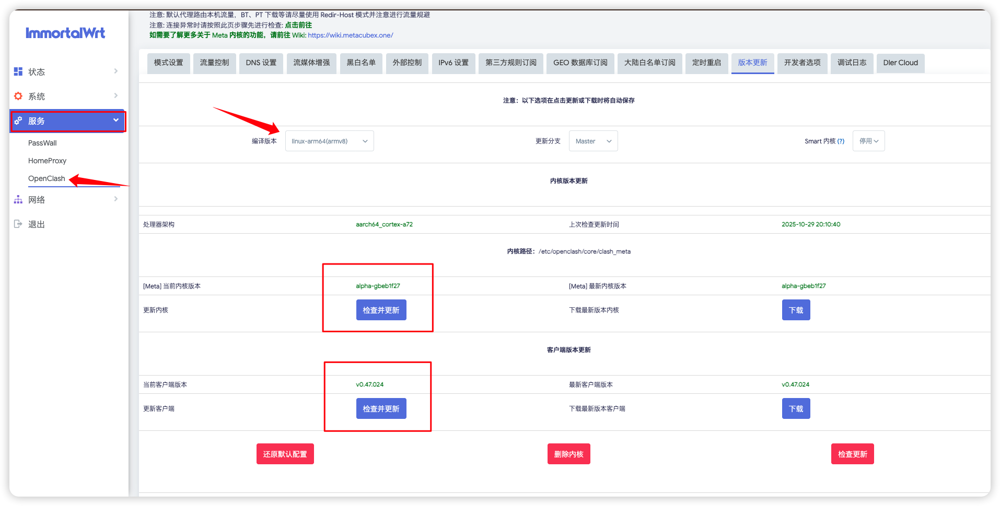
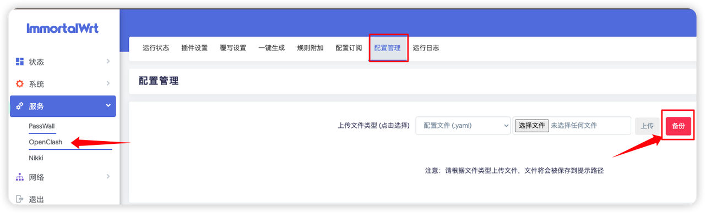

<a id="chinese"></a>
[🇨🇳 中文文档](#chinese) | [🇺🇸 English](#english)

# OpenClash 配置手册

这份手册专门解决两个现实问题：

- 新旧 OpenWrt 的软件包管理方式已经分流
- OpenClash 能用，但默认配置不够省心，尤其是需要频繁手动切节点

本文统一采用“一份文档，按版本分流”的写法。原因很简单：`24.10 及更早` 和 `25.12 及更新版本` 的主要区别集中在“安装软件包”这一步，后面的 OpenClash 导入、YAML 规则、分流逻辑、DNS 注意事项基本是同一套思路。拆成两篇文档，维护成本更高，也更容易让读者看错。

## 先看结论

根据 OpenWrt 官方 Wiki：

- `OpenWrt 24.10 及更早稳定版`：仍以 `opkg` 为主
- `OpenWrt 25.12 及更新版本 / 新分支`：改用 `apk`，用于替代 `opkg`

对应到本仓库：

- 你如果只想“导入就用”，推荐 [config_linkedin_auto.yaml](../config_linkedin_auto.yaml)
- 你如果只想修复 LinkedIn 跳中国，但不改自动切换策略，用 [config_linkedin.yaml](../config_linkedin.yaml)
- 你如果遇到 GitHub SSH 22 端口问题，用 [config_linkedin_auto_ssh22_redir.yaml](../config_linkedin_auto_ssh22_redir.yaml)

## 第 0 步：先判断你的系统属于哪一类

先 SSH 进去执行：

```bash
cat /etc/openwrt_release
```

重点看 `DISTRIB_RELEASE`：

- `24.10.x`、`23.x`、更早稳定版：按 `opkg` 路线操作
- `25.12.x`、后续新稳定版、新分支：按 `apk` 路线操作

如果你只是打开 LuCI 网页后台，界面上看起来可能差不多，但底层包管理器已经不同了。不要再拿 `opkg` 的命令去硬套 `25.12+`。

## 第 1 步：安装前准备

正式装 OpenClash 之前，先确认这几件事：

1. 路由器已经能正常联网
2. 系统时间基本正确
3. 你已经准备好机场订阅链接
4. 你知道自己当前系统是 `opkg` 还是 `apk`

如果这四件事没有确认好，后面很多“安装失败”“依赖不对”“订阅更新不了”的问题都会混在一起，很难排查。

## 第 2 步：按版本选择安装路径

这里其实只需要先做一个判断，然后沿着对应命令走下去。

1. **如果你是 `OpenWrt 24.10 及更早稳定版`。**

这类系统继续使用 `opkg`。

常见基础命令：

```bash
opkg update
opkg install <package-name>
```

如果你是手动安装本地包，通常会遇到的是 `.ipk` 文件：

```bash
opkg install /tmp/example.ipk
```

适合这一路线的人群：

- 老设备
- 仍停留在 `24.10.x` 或更早稳定版
- 现有教程、旧博客、旧视频基本都还是按这条路线写的

2. **如果你是 `OpenWrt 25.12 及更新版本 / 新分支`。**

这类系统已经改用 `apk`。

常见基础命令：

```bash
apk update
apk add <package-name>
```

如果你是手动安装本地包，优先按新格式处理：

```bash
apk add --allow-untrusted /tmp/example.apk
```

这一点非常关键：

- `25.12+` 不要再照抄旧教程里的 `opkg install`
- 如果第三方插件只提供旧格式包，先确认插件作者是否已适配新分支
- 不要强行混装旧包格式

最后记住这一点，不要把它当成可选提醒：

根据 OpenWrt 官方的 `opkg -> apk` 对照说明：

- `apk update` 可以正常使用
- 不要把 `apk upgrade` 当成常规升级手段
- 要做整体升级，更安全的方式是 `Attended Sysupgrade`、`owut` 或重新构建/刷写固件

这不是语法问题，而是系统稳定性问题。别把“包管理器换了”理解成“所有 Linux 升级习惯都能直接照搬”。

## 第 3 步：选择本仓库里的 YAML 配置

仓库根目录目前提供 4 份配置：

| 文件 | 适合谁 | 说明 |
| --- | --- | --- |
| [config.yaml](../config.yaml) | 想从基础版自己改的人 | 基础模板 |
| [config_linkedin.yaml](../config_linkedin.yaml) | 想修复 LinkedIn 跳转问题的人 | 保留当前 DNS 思路，修复 LinkedIn 规则冲突 |
| [config_linkedin_auto.yaml](../config_linkedin_auto.yaml) | 大多数人 | 推荐版，减少手动切节点 |
| [config_linkedin_auto_ssh22_redir.yaml](../config_linkedin_auto_ssh22_redir.yaml) | 遇到 GitHub SSH 22 端口问题的人 | 针对 `redir-host` / Redir 场景的兼容版 |

推荐顺序：

1. 先从 `config_linkedin_auto.yaml` 开始
2. 如果你明确只想保留手动策略，再回退到 `config_linkedin.yaml`
3. 如果 GitHub `ssh -T git@github.com` 在 22 端口有问题，再试 `config_linkedin_auto_ssh22_redir.yaml`

## 第 4 步：导入配置文件

无论你是 `opkg` 还是 `apk` 系统，OpenClash 的配置导入思路都一样。

按这个顺序做就行。

1. **先改订阅链接。**

打开你要用的 YAML 文件，找到：

```yaml
proxy-providers:
  Airport1:
    url: "这里填写机场订阅"
```

把 `url` 改成你自己的订阅地址。

注意：

- 不要把订阅链接直接提交到 GitHub
- 如果你准备分享配置文件，请始终保留占位符

2. **再导入 OpenClash。**

常见做法有两种：

1. 在 OpenClash 后台直接上传配置文件
2. 手动放到 OpenClash 配置目录后，在页面里选择它

导入后：

1. 进入 OpenClash
2. 选择对应配置文件
3. 启动或重载配置
4. 等待订阅拉取和规则加载完成

## 第 5 步：为什么推荐 `config_linkedin_auto.yaml`

你之前最不舒服的问题，是“需要经常进后台手动切节点”。

这份推荐配置的处理方式是：

- 保留你现在已经验证没问题的 DNS 思路
- 不动 LinkedIn 相关的关键分流逻辑
- 只把常用业务组从“手动选节点”改成“自动故障切换”

换句话说，这不是把整份配置推倒重写，而是只改最影响体验的那一层。

它实际做的事情很集中：

`config_linkedin_auto.yaml` 里的核心变化是：

- 顶层常用服务组改成 `fallback`
- 区域组继续用 `url-test` 做测速选择
- `LinkedIn` 相关 DNS / fake-ip / 规则冲突处理保持不动

这样做的实际效果是：

- 某个节点挂了，自动切到下一个可用节点
- 平时不需要频繁进后台手动改组
- 不破坏你当前已经验证可用的 LinkedIn 访问行为

## 第 6 步：自己添加直连规则

很多人真正会长期用到的，不是“怎么导入 YAML”，而是“我以后自己怎么加站点规则”。

这部分要掌握。

1. **规则加在哪里。**

请到 YAML 里的 `rules:` 区域去加，优先放在自定义规则前部，例如：

```yaml
rules:
  - DOMAIN-SUFFIX,example.edu,DIRECT
  - DOMAIN,sub.example.edu,DIRECT
  - IP-CIDR,1.2.3.0/24,DIRECT,no-resolve
```

规则是从上到下匹配的，所以：

- 越靠前，优先级越高
- 你自己新增的站点，建议放在通用规则前面
- 如果放得太靠后，前面的 `RULE-SET` 可能已经把它匹配走了

2. **为什么很多学术网站要走直连。**

你仓库里的配置已经把一批常见学术站点放进直连，例如：

- `dl.acm.org`
- `ieeexplore.ieee.org`
- `sciencedirect.com`
- `nature.com`
- `science.org`

原因通常是：

- 学校或机构网络对这些站点有源 IP 识别
- 走代理后，站点可能把你识别成普通公网出口
- 最后表现为“能打开首页，但下载文献异常”或“权限识别不对”

如果你还有别的学校资源站点，也按同样思路加：

```yaml
- DOMAIN-SUFFIX,xxx.edu.cn,DIRECT
- DOMAIN-SUFFIX,library.example.edu,DIRECT
```

3. **如果你想让某个站点走代理。**

把末尾的 `DIRECT` 改成你想走的策略组即可，例如：

```yaml
- DOMAIN-SUFFIX,example.com,🚀 默认代理
- DOMAIN-SUFFIX,ai.example.com,🤖 ChatGPT
```

最常见的几种写法：

- `DIRECT`：直连
- `🚀 默认代理`：交给默认代理组
- `🍀 Google`：强制走 Google 分组
- `📲 Telegram`：强制走 Telegram 分组

4. **改规则时最容易犯的错。**

1. 新规则加得太靠后，结果根本没生效
2. 域名写错，把 `DOMAIN` 和 `DOMAIN-SUFFIX` 混用了
3. 明明是 DNS / LinkedIn 问题，却去乱改规则组
4. 改完没有重载 OpenClash

## 第 7 步：LinkedIn 相关配置不要乱动哪里

如果你当前的 LinkedIn 行为是正常的，这几类内容尽量别随便动：

- `dns:` 整块
- `fake-ip-filter` 里的 LinkedIn / 中国站点排除逻辑
- `cn_domain` 里的 LinkedIn 过滤项
- `rules:` 里对 LinkedIn 的单独指定规则

原因不是它们“更高级”，而是这些地方互相有关联。你只改其中一处，往往会把“跳中国站”“解析异常”“规则冲突”重新引回来。

## 第 8 步：常见问题

1. **为什么我还是在手动切节点？**

先检查两件事：

1. 你实际导入的是不是 [config_linkedin_auto.yaml](../config_linkedin_auto.yaml)
2. OpenClash 当前激活的配置文件是不是这份

很多时候不是自动切换没生效，而是后台还在跑旧配置。

2. **为什么 LinkedIn 又跳到中国区了？**

优先检查：

1. 有没有改过 `dns:` 相关设置
2. 有没有恢复“绕过大陆”但没处理 LinkedIn 排除
3. 有没有把 LinkedIn 相关自定义规则删掉

3. **为什么 25.12 系统按旧教程装不上？**

因为很多旧教程默认前提还是：

- `opkg`
- `.ipk`
- 旧插件源

而你的系统已经切到 `apk` 路线了。先确认教程是不是基于 `24.10` 或更早版本写的，再决定能不能照抄。

4. **为什么学术网站打开正常，但文献下载不对？**

这类情况通常不是网页打不开，而是出口 IP 身份不对。优先把对应站点加入直连规则，再重载测试。

## 官方参考

- OpenWrt `apk` 文档：https://openwrt.org/docs/guide-user/additional-software/apk
- OpenWrt `opkg` 文档：https://openwrt.org/docs/guide-user/additional-software/opkg
- OpenWrt `opkg -> apk` 对照表：https://openwrt.org/docs/guide-user/additional-software/opkg-to-apk-cheatsheet
- OpenClash 维护参考：https://blog.dreamtobe.cn/openclash_maintain/
- 自定义 OpenClash 规则参考：https://github.com/Aethersailor/Custom_OpenClash_Rules

## 图示

- OpenClash 更新



- OpenClash 备份



---

<a id="english"></a>
[🇨🇳 中文文档](#chinese) | [🇺🇸 English](#english)

# OpenClash Guide

This guide now uses a single-document split by version:

- `OpenWrt 24.10 and earlier stable releases`: use `opkg`
- `OpenWrt 25.12 and newer`: use `apk`

This follows the official OpenWrt documentation:

- `apk` is used in OpenWrt `25.12+`
- `opkg` remains the older package-manager path

## Quick Start

1. Check your release:

```bash
cat /etc/openwrt_release
```

2. Pick your package workflow:

- `24.10.x` or older: `opkg`
- `25.12.x` or newer: `apk`

3. Pick a config file from repo root:

- [config.yaml](../config.yaml): base template
- [config_linkedin.yaml](../config_linkedin.yaml): LinkedIn DNS/rule fix
- [config_linkedin_auto.yaml](../config_linkedin_auto.yaml): recommended smart-switch version
- [config_linkedin_auto_ssh22_redir.yaml](../config_linkedin_auto_ssh22_redir.yaml): GitHub SSH 22 workaround

4. Edit your subscription URL:

```yaml
proxy-providers:
  Airport1:
    url: "your-subscription-url"
```

5. Import the YAML into OpenClash and reload it.

## Package Manager Split

Read this as one decision point with two branches.

1. **OpenWrt 24.10 and earlier**

```bash
opkg update
opkg install <package-name>
opkg install /tmp/example.ipk
```

2. **OpenWrt 25.12 and newer**

```bash
apk update
apk add <package-name>
apk add --allow-untrusted /tmp/example.apk
```

Do not keep copying old `opkg` commands onto `25.12+`.

Also, follow OpenWrt's warning: do not use `apk upgrade` as a generic full-system upgrade path.

## Recommended YAML

[config_linkedin_auto.yaml](../config_linkedin_auto.yaml) is the default recommendation because it:

- keeps the working LinkedIn DNS logic
- keeps the current fake-IP handling
- changes the common service groups to automatic failover
- reduces the need to manually switch nodes in the web UI

## Custom Direct Rules

Add custom rules in the `rules:` section near the top of your custom area:

```yaml
- DOMAIN-SUFFIX,example.edu,DIRECT
- DOMAIN,sub.example.edu,DIRECT
- IP-CIDR,1.2.3.0/24,DIRECT,no-resolve
```

To proxy instead, replace `DIRECT` with a target group such as `🚀 默认代理`.

Academic sites often need direct routing because access rights may depend on the source IP of your campus or institution network.

## References

- OpenWrt `apk`: https://openwrt.org/docs/guide-user/additional-software/apk
- OpenWrt `opkg`: https://openwrt.org/docs/guide-user/additional-software/opkg
- OpenWrt `opkg -> apk` cheatsheet: https://openwrt.org/docs/guide-user/additional-software/opkg-to-apk-cheatsheet
