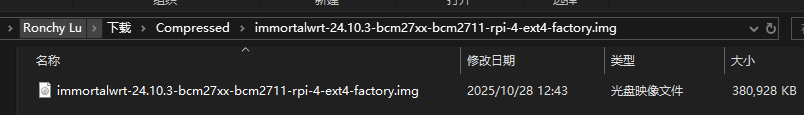
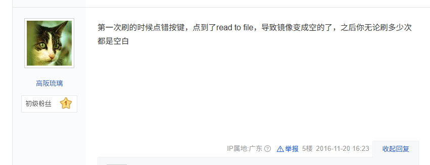
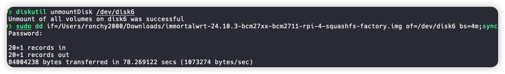

[🇨🇳 中文文档](#chinese) | [🇺🇸 English](#english)

<a id="chinese"></a>
# 烧录固件工具及步骤
## Windows
下载相关.gz后缀固件，解压：



把目录下的.img烧录到新介质中。选择好文件后，点击Write写入。


成功后弹出：让你格式化磁盘，这里点取消。弹出报错信息：无法访问...，点确定。这就成功烧录进入了！

<strong>常见问题</strong>，如果你烧录完，U盘还是空的，那么一定是第一次点成read了,导致把u盘中的内容写入到了img文件中。解决方法：你需要重新解压，再烧录（这次别再点错了！



## MacOS
> MacOS烧录方法请参考：https://stepneverstop.github.io/burn-system2raspberry-in-macos.html

1. 下载[SD Memory Card Formatter](https://www.sdcard.org/downloads/formatter/eula_mac/index.html)格式化U盘

2. 命令烧录/傻瓜式烧录：镜像烧录工具 [balenaEtcher](https://etcher.balena.io/)

```bash
# 查看驱动器列表
# 在控制台输入命令：diskutil list
# 这里，我们获取到TF卡的磁盘路径为/dev/disk6

# 取消TF卡的挂载
#在控制台输入命令：diskutil unmountDisk + SD卡设备路径
diskutil unmountDisk /dev/disk6
# 输出：Unmount of all volumes on disk6 was successful

# 开始烧录
# 在控制台输入命令：sudo dd if=镜像路径 of=SD卡设备的路径 bs=1m;sync，并输入管理员密码。
# 注意：文件路径不要出现中文。可以将bs=1m改为bs=4m加快烧录的速度。
# 这个时间有点长，需要耐心等待，400M的镜像大概耗时2分钟左右。
```



3. 推出TF卡/U盘。
```bash
diskutil eject /dev/disk6
```
4. 拔出介质，安装到树莓派上。

结束。

---

[🇨🇳 中文文档](#chinese) | [🇺🇸 English](#english)

<a id="english"></a>
# Firmware Writing Tools and Steps

## Windows
Download the firmware with the .gz suffix and extract it:


Burn the .img file in the directory to a new device. After selecting the file, click "Write" to start writing.


After success, a prompt will pop up asking you to format the disk—click Cancel. If an error message appears saying "Cannot access...", click OK. The burning process is now complete!

**Common Issue:**  
If your USB drive is still empty after burning, you probably clicked "Read" the first time, which wrote the USB contents into the img file. Solution: Re-extract the firmware and burn it again (make sure not to click the wrong button this time)!


## MacOS
> For MacOS burning methods, please refer to: https://stepneverstop.github.io/burn-system2raspberry-in-macos.html

1. Download [SD Memory Card Formatter](https://www.sdcard.org/downloads/formatter/eula_mac/index.html) to format the USB drive.

2. Command-line or easy burning: Use the image burning tool [balenaEtcher](https://etcher.balena.io/)

```bash
# List all drives
# Enter the command in the terminal: diskutil list
# Here, we get the disk path of the TF card as /dev/disk6

# Unmount the TF card
# Enter the command in the terminal: diskutil unmountDisk + SD card device path
diskutil unmountDisk /dev/disk6
# Output: Unmount of all volumes on disk6 was successful

# Start burning
# Enter the command in the terminal: sudo dd if=path_to_image of=SD_card_device_path bs=1m;sync, and enter the admin password.
# Note: Do not use Chinese characters in the file path. You can change bs=1m to bs=4m to speed up the burning process.
# This process takes some time; for a 400MB image, it takes about 2 minutes.
```


3. Eject the TF card/USB drive.
```bash
diskutil eject /dev/disk6
```
4. Remove the media and install it on the Raspberry Pi.

End.