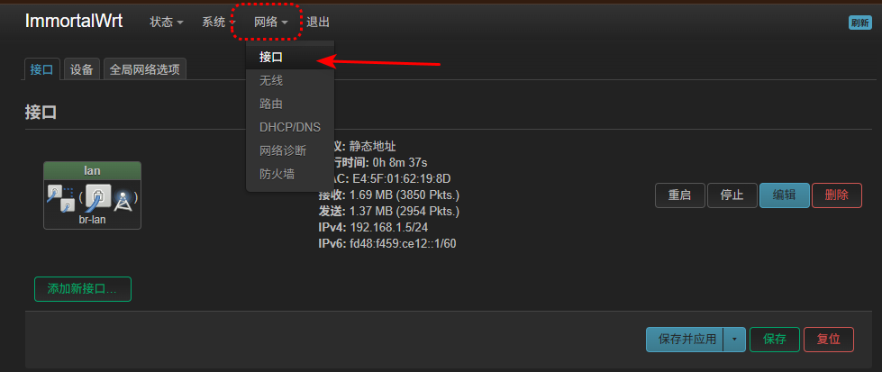
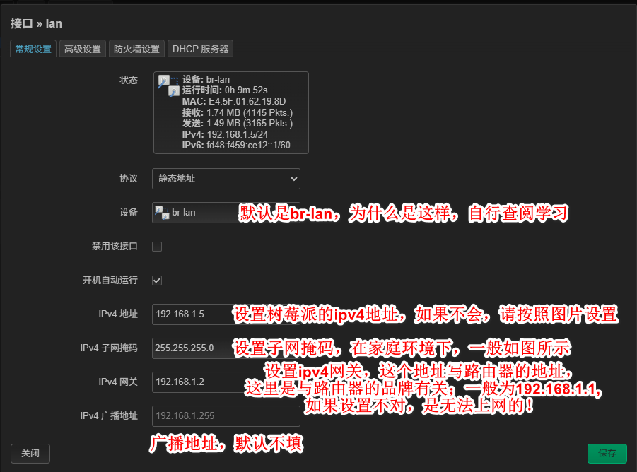
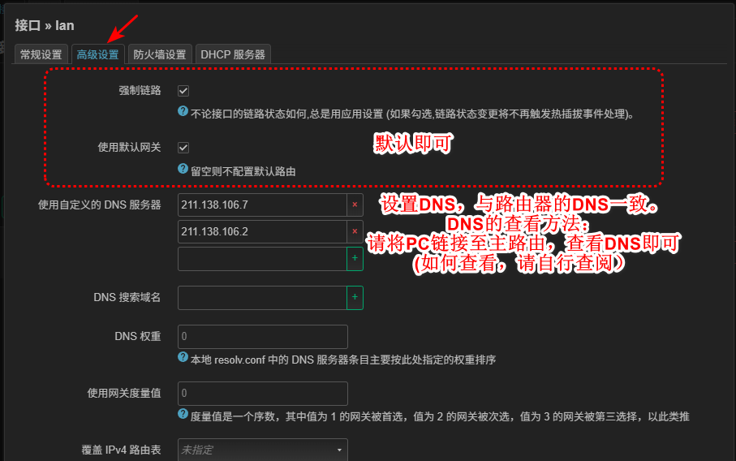
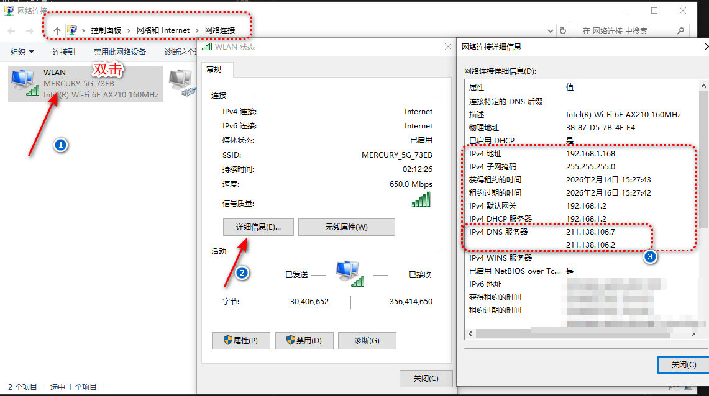
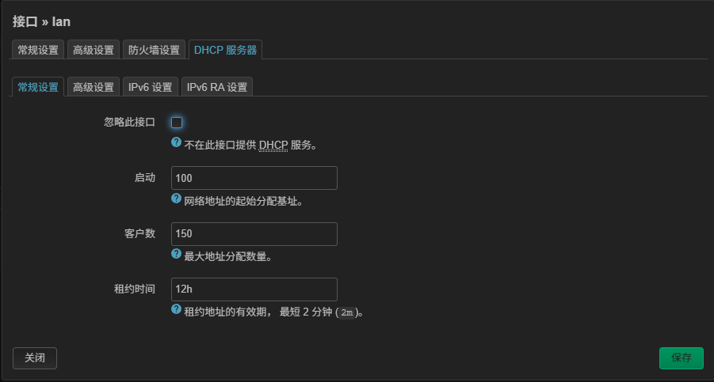

# LAN Connection (Upstream Router LAN Uplink)

This guide is for the common setup where your Raspberry Pi running ImmortalWrt gets internet from an upstream router, and devices connected to the Pi Wi-Fi can also access the internet.

This setup is often called "bypass router" or "secondary router", but this document uses a clearer name: **upstream router LAN uplink**.

## Where To Configure

In LuCI Web UI, go to: `Network -> Interfaces`, find `LAN` (or the interface you want to edit), then click `Edit`.

## Interface Settings

### 1. General Settings

Follow the screenshot and keep the values consistent with the example.

### 2. DNS Settings

Fill DNS as shown in the screenshot.

Common DNS input locations are shown below:

### 3. DHCP Settings

If you are not familiar with DHCP, keep your settings exactly the same as the screenshot.

## Verification

1. Click **Save & Apply**.
2. Connect a device to the Raspberry Pi Wi-Fi and confirm internet access works.

If OpenClash is enabled on the Raspberry Pi, devices connected to that Wi-Fi will follow your OpenClash rules.

> Reference video: Raspberry Pi LAN uplink setup (YouTube)
> https://www.youtube.com/watch?v=jrqwhug_nO8

