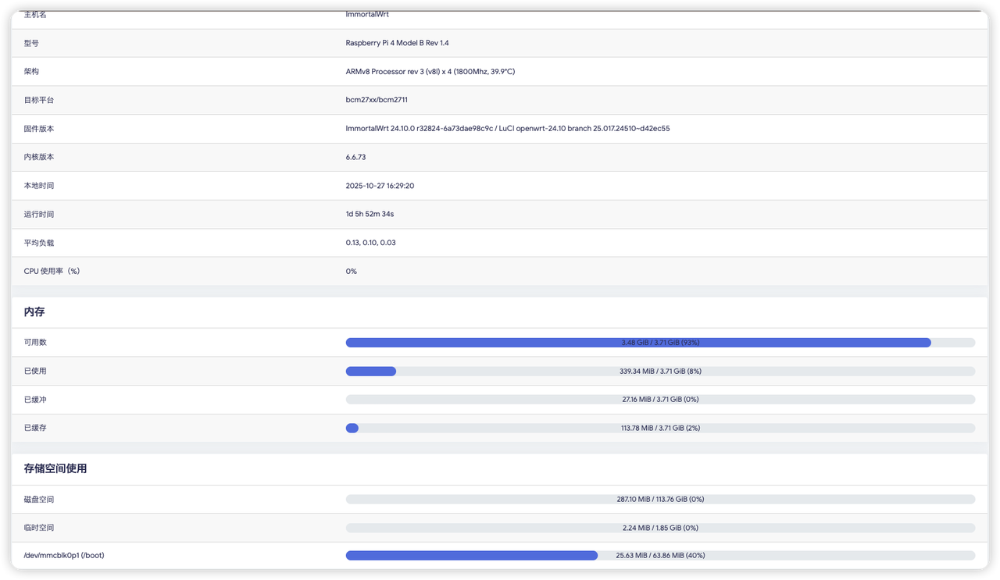
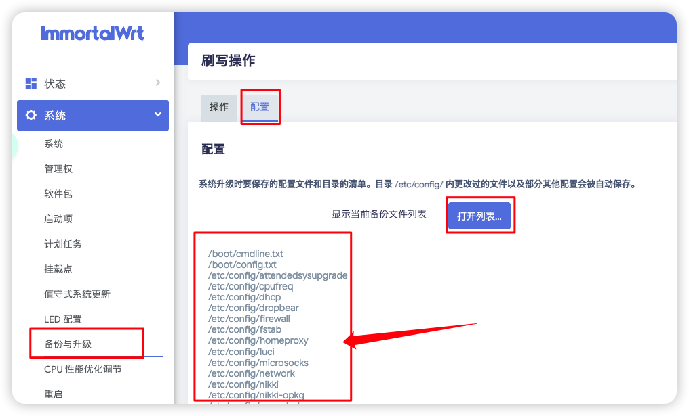
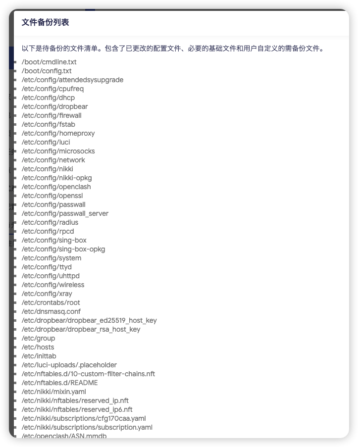
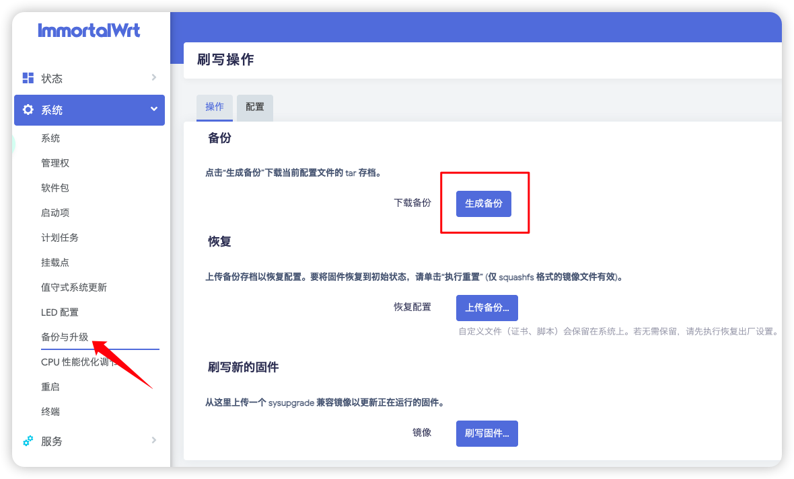
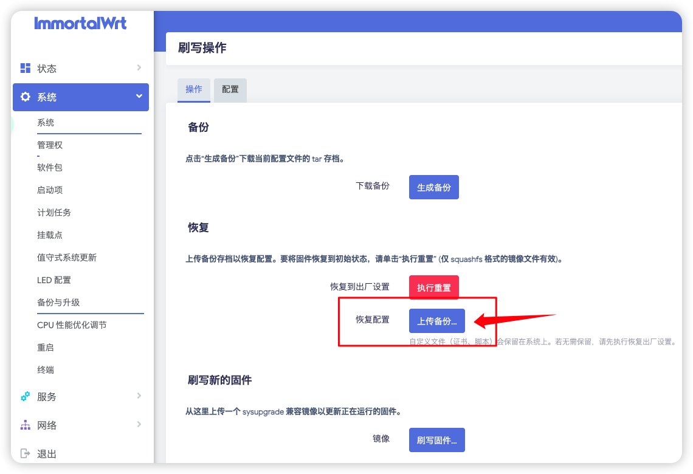

# Backup and Restore

> Since the author's SD card is 128GB, all mounted to the OpenWrt system, but the entire system only consumes 287MB of resources, which is a bit overkill. Therefore, the plan is to backup and switch to a 4GB memory card.



## Backup

1. Go to system settings and fill in the `Backup List`.



2. In `System -> Backup & Upgrade -> Generate Backup`
Backup system-related configurations: (Save file to local)

If the backup file is only 170B, this size definitely indicates an error! Please turn off your IDM or NDM plugin and use the browser's default download.

Backup complete.

> If you exported the backup in system settings, OpenClash will also be included in the backup; the following is just a separate plugin backup method. (Optional)
Backup OpenClash-related configurations: (Save file to local)


Backup complete.

## Restore

Take out new card or USB drive.

### Flash Firmware
Flash the Raspberry Pi related version firmware. Please see OpenWrt [Firmware Selection](../../README_EN.md#firmware_selection_en) and [Flashing Tutorial](./Write_Image.md)

### Restore Backup

<strong>Important: If you do not perform the following operations and directly upload the backup from `Backup & Restore` settings, it will report errors! And it's difficult to resolve! The best way is to install plugins on the new system first, then upload the backup file.</strong>

After flashing the firmware, please configure the network first, i.e., OpenWrt can update software packages, and install the following content:
> Install cargo luci theme to enhance interface aesthetics (refer to video at 33:12) https://www.youtube.com/watch?v=JfSJmPFiL_s&t=1992s

If you know how to install it yourself, follow these steps directly:

`System--Software Packages--Update Lists--No errors--Install luci-theme-argon--Install luci-i18n-ttyd-zh-cn`

Plugin Installation:
- luci-app-openclash
- luci-i18n-passwall-zh-cn
- luci-i18n-homeproxy-zh-cn
- luci-i18n-quickstart-zh-cn

Plugin location: In the "Services" tab on the sidebar.

If you prefer command line, run:

```bash
# Install iStore (ARM64 & x86-64 universal)
wget -qO imm.sh https://cafe.cpolar.cn/wkdaily/zero3/raw/branch/main/zero3/imm.sh && chmod +x imm.sh && ./imm.sh

# Install quickstart wizard and homepage (ARM64 & x86-64 universal)
is-opkg install luci-i18n-quickstart-zh-cn
```

Important: If you do not perform the <strong>above operations</strong> and directly upload the backup from `Backup & Restore` settings, it will report errors! And it's difficult to resolve!

After installing the plugins, go to system settings to upload the backup:



Restore complete. You can exit this document now!

If you are a command-line user, please follow me.
---

### Command Line Backup and Restore

1. Install SFTP service for OpenWrt:
```bash
opkg update 
opkg install openssh-sftp-server
```
2. After installing `luci-theme-argon`, go to System--Backup & Upgrade--Upload Backup.
3. Install plugins (recommended before restore):
```bash
is-opkg install luci-app-openclash
is-opkg install luci-i18n-passwall-zh-cn
is-opkg install luci-i18n-homeproxy-zh-cn
is-opkg install luci-i18n-quickstart-zh-cn

# Install iStore (ARM64 & x86-64 universal)
wget -qO imm.sh https://cafe.cpolar.cn/wkdaily/zero3/raw/branch/main/zero3/imm.sh && chmod +x imm.sh && ./imm.sh
```
4. Restore OpenClash configuration files (after testing, this is not necessary, OpenClash-related backup is already included in the system backup)

Success!

---

