[🇨🇳 中文文档](../PPPoE_Connection.md) | [🇺🇸 English](./PPPoE_Connection.md)

# PPPoE Dial-Up Configuration

This guide is for two common cases:

- home broadband PPPoE, where the Raspberry Pi soft router should dial directly
- campus or ISP environments where PPPoE works inconsistently, WiFi becomes unstable, or the wireless network disappears after boot

If your Raspberry Pi only connects to an upstream router through `LAN`, this is not your main path. Read [LAN Connection](./Lan_Connectioin.md) first.

## Understand the layout first

On a single-port Raspberry Pi, the biggest mistake is usually not the PPPoE username or password.  
The real problem is mixing up `LAN` and `WAN`.

The correct design is:

1. PPPoE lives only on the logical `WAN` side interface
2. the `LAN` interface stays on `br-lan`
3. the `br-lan` bridge must be allowed to start even when it has no bridge ports yet

If you directly bind `LAN` to a wireless device or break the bridge relationship, common results include:

- AP attachment problems
- `br-lan` failing to start or starting in the wrong order
- WiFi disappearing after boot
- clients joining WiFi but failing to reach the internet

So the real goal is not just “make PPPoE dial successfully”.  
The real goal is “keep the `LAN -> br-lan -> WiFi` chain intact”.

## Typical failure symptom

Campus networks and some ISP environments may show errors like this when dial-up fails:

  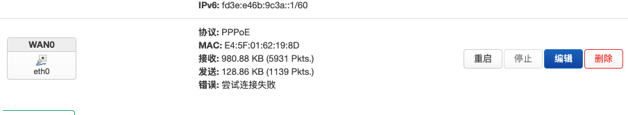
  
<em>Figure 1: Typical error screen when PPPoE dial-up fails.</em>

> Reference video:  
> [Installing OpenWrt on Raspberry Pi as Main Router and Solving Campus Login Page Access Issues](https://www.bilibili.com/video/BV1ni4y1d76Z/?vd_source=f63c5bad02603bd4f2c19cf640c71d1f)

## Step 1: Create `WAN0` and enter the PPPoE account

In `Network -> Interfaces`, create `WAN0`, choose protocol `PPPoE`, and enter the account and password provided by your ISP or campus network.

  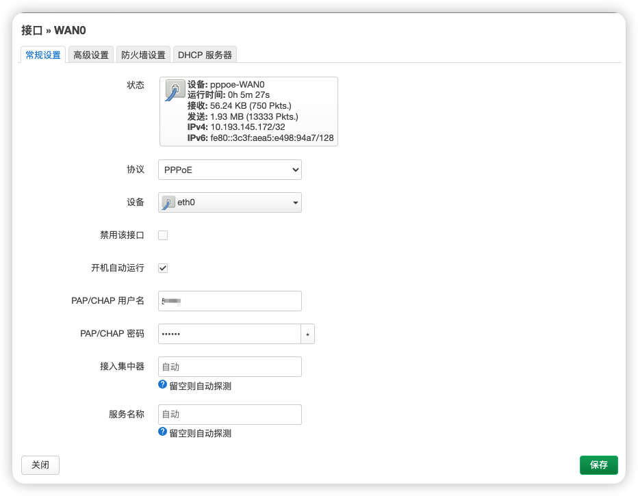
  
<em>Figure 2: Create the WAN0 interface and set its protocol to PPPoE.</em>

After that, the firewall zone for `WAN0` must be `wan`.  
If `WAN0` is not placed in the `wan` firewall zone, the usual result is:

- the router itself dials successfully
- clients can still join WiFi
- but end devices cannot access the internet correctly

That happens because `LAN -> WAN` forwarding, NAT, and outbound policies all depend on the correct firewall zone.

  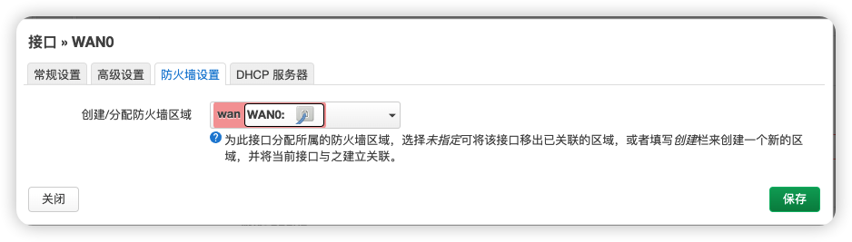
  
<em>Figure 3: WAN0 should be assigned to the <code>wan</code> firewall zone.</em>

## Step 2: Keep the LAN interface on `br-lan`

Do not casually change the device bound to `LAN`.  
It should remain:

- `Network device: "br-lan" (lan)`

It should not be replaced with a wireless device, and it should not be tied directly to the PPPoE tunnel.

  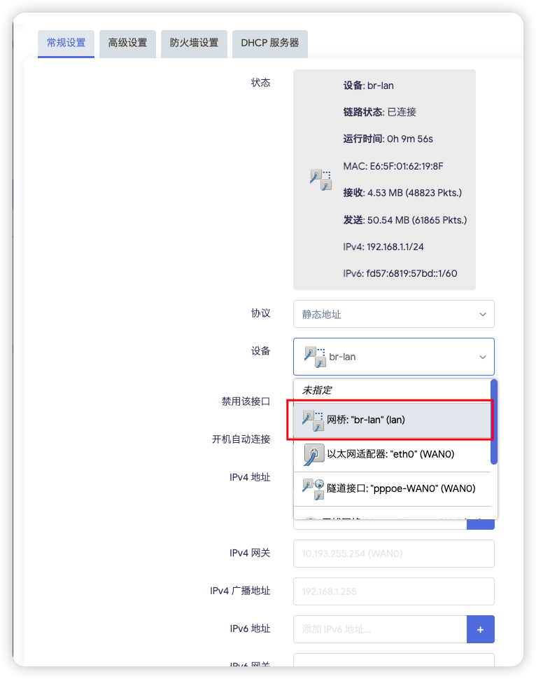
  
<em>Figure 4: Keep the LAN interface bound to <code>br-lan</code>.</em>

The wireless AP is supposed to attach to the `LAN` side bridge.  
The design should not be reversed so that `LAN` depends on the wireless device itself.
The correct wireless binding example is shown in [Step 5: Keep wireless networks attached to LAN](#wifi-lan-bind).

If you incorrectly bind `LAN` to the wireless side, you create a dependency loop:

- `LAN` depends on wireless
- wireless also depends on `LAN / bridge` to exist properly

That often leads to unstable startup ordering and broken bridge state, such as:

- WiFi missing after boot
- SSID appearing inconsistently
- clients failing to obtain valid addresses

The following is the kind of configuration you should avoid:

  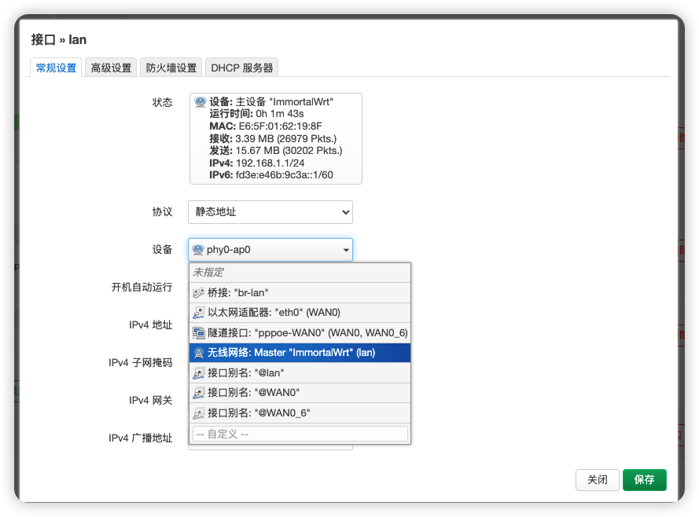
  
<em>Figure 5: Wrong example. Do not change the LAN device to a wireless device or another incorrect interface.</em>

## Step 3: Keep the LAN firewall zone as `lan`

The `LAN` interface should remain in the `lan` firewall zone and should not be mixed into `wan`.

If this is wrong, common symptoms are:

- WiFi clients can connect but routing behaves incorrectly
- DHCP or local access becomes unstable
- LAN/WAN boundaries become unclear

  
  
<em>Figure 6: Keep the LAN interface inside the <code>lan</code> firewall zone.</em>

## Step 4: Configure the `br-lan` bridge device

This is the part many users miss.

Go to `Network -> Interfaces -> Devices`, find `br-lan`, and click `Configure`.

  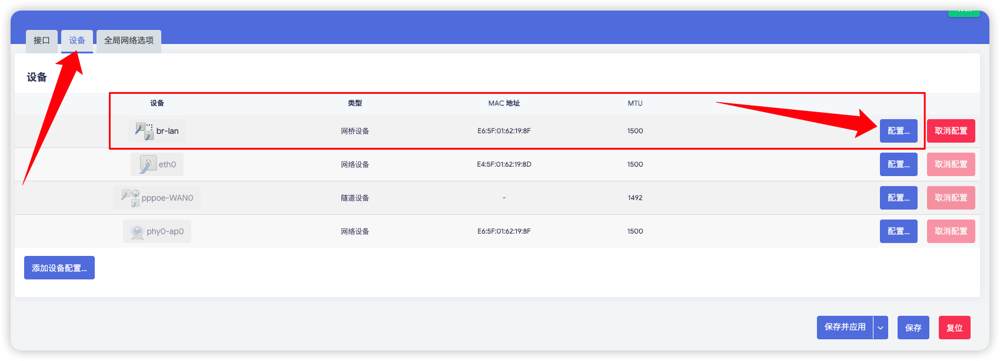
  
<em>Figure 7: Open the <code>br-lan</code> device configuration page from the Devices tab.</em>

In the `br-lan` configuration page, leave `Bridge ports` empty.  
Do not force `eth0`, `pppoe-WAN0`, or other devices into that list.

  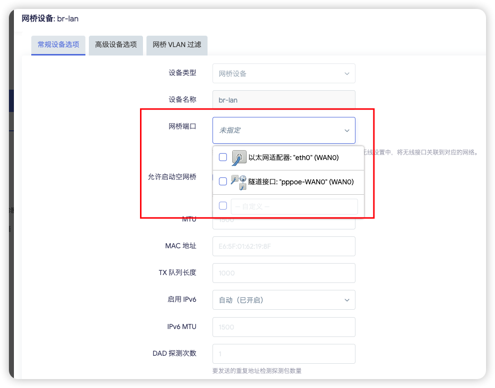
  
<em>Figure 8: Leave the <code>br-lan</code> bridge ports empty.</em>

This setting describes the membership of the bridge device itself.  
If you incorrectly add WAN-side devices or the PPPoE tunnel here, you blur the separation between LAN and WAN.

At the same time, enable “Bring up empty bridge”.  
It allows `br-lan` to start even when it does not yet have bridge members at that moment.

  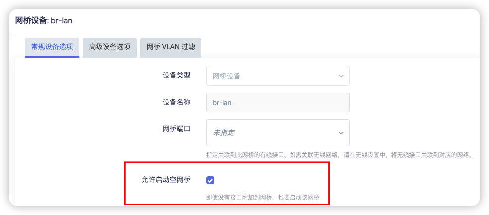
  
<em>Figure 9: Enable “Bring up empty bridge” so <code>br-lan</code> can start even when the bridge is temporarily empty.</em>

If you leave it disabled, some boot sequences may cause:

- `br-lan` not starting in time
- the wireless AP failing to attach correctly
- WiFi disappearing or failing to broadcast after reboot

<!-- Caption extension hook: add firmware-theme-specific UI notes here if needed. -->

## Step 5: Keep wireless networks attached to LAN

If you added one or more wireless configurations, whether they are the main SSID or extra SSIDs, they should still be attached to `lan`, not to `WAN0`.

First go to `Network -> Wireless` and edit the wireless configuration you want to keep on the LAN side.

  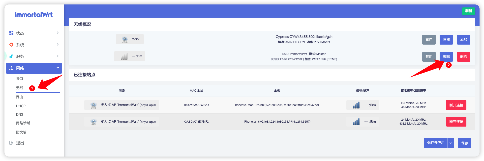
  
<em>Figure 10: Open the wireless configuration from the Wireless page.</em>

Then set the wireless interface `Network` field to `lan`, not `WAN0`.  
If you added two wireless configurations, apply the same rule to both.

  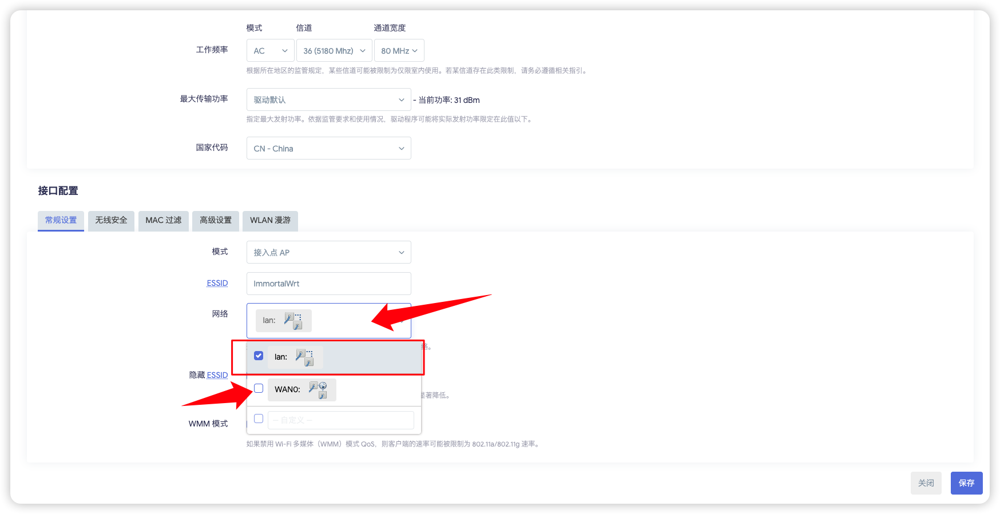
  
<em>Figure 11: Bind the wireless interface to <code>lan</code>, not <code>WAN0</code>.</em>

The reason is straightforward:

- a wireless AP belongs to the internal access side
- `WAN0` is the external dial-up side
- binding wireless to `WAN0` pushes client access onto the wrong side of the firewall and routing model

## Step 6: Save and verify the final state

After applying the configuration, go back to the interface overview.  
The ideal result is:

- `lan` still exists and still uses `br-lan`
- `WAN0 / pppoe-WAN0` dials successfully
- WiFi broadcasts normally
- clients can connect and access the internet

  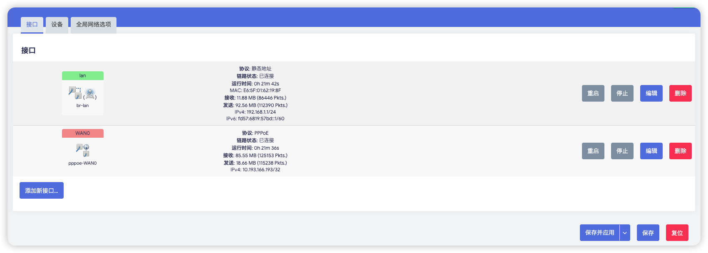
  
<em>Figure 12: Final correct state after configuration, with clear separation between LAN and WAN0.</em>

## Common checks

### 1. WiFi disappears after boot

Check these first:

1. whether the `LAN` device is still `br-lan`
2. whether the `br-lan` bridge ports are still empty
3. whether “Bring up empty bridge” is enabled

### 2. WiFi works, but there is no internet

Check these first:

1. whether `WAN0` really dialed successfully
2. whether `WAN0` belongs to the `wan` firewall zone
3. whether `LAN` still belongs to the `lan` firewall zone

### 3. It works on macOS but not on Windows, or the reverse

Before suspecting PPPoE itself, check client-side network priority.

- `macOS`: move WiFi to a higher network priority
- `Windows`: disconnect Ethernet and test with WiFi only

Otherwise the client may still be preferring another NIC, which makes it look like the router configuration is wrong.

## Done

At this point, the Raspberry Pi can operate as the main PPPoE router, and clients connected to its WiFi should be able to reach the internet normally.
