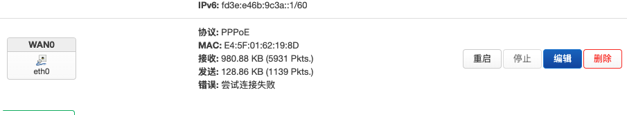

# PPPoE Dial-up Connection Solution

> For home dial-up, the software router acts as the main router. Related dial-up account acquisition is not covered here. Please see [Bridging Mode Tutorial](https://github.com/Ronchy2000/Home-Network-Router-Bridging-Solution).

Campus network dial-up is more complex and may fail due to device type detection.

  

## Solution:
> Reference this tutorial to solve dial-up issues: [Installing OpenWrt on Raspberry Pi as Main Router and Solving Campus Network Login Page Access Issues](https://www.bilibili.com/video/BV1ni4y1d76Z/?vd_source=f63c5bad02603bd4f2c19cf640c71d1f)

### 1. Create WAN0 Interface and Configure Dial-up Account

This firewall setting is very important! Otherwise WiFi won't work!

### 2. LAN Port Settings: Change Device to Wireless Network

  

### 3. Troubleshooting: Set WiFi to Highest Priority

If you encounter issues, set WiFi to the highest priority and test again! (This applies to macOS; for Windows, disconnect Ethernet connection to consider network priority)

Final result as shown below:

  

---
## At this point, all devices in your home connected to the Raspberry Pi WiFi can successfully access the internet!
