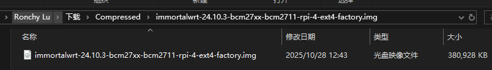
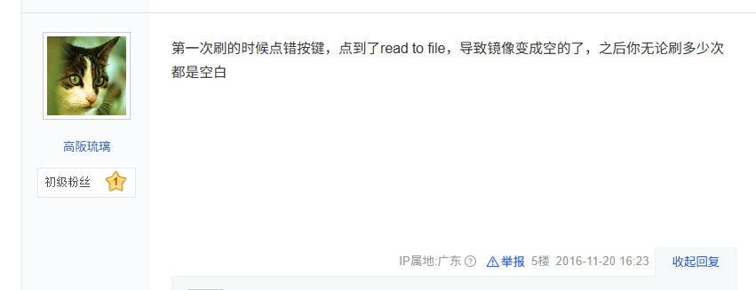

# Firmware Writing Tools and Steps

- Firmware Source: [ImmortalWrt Firmware Selector](https://firmware-selector.immortalwrt.org)
- Important Notes:
  - EXT4 version will overwrite all user settings `(Overwrite mode - flash this firmware if you need to reconfigure!)`
  - SQUASHFS version preserves user configurations after flashing `(Incremental mode)`

## Windows
Download the firmware with the .gz suffix and extract it:



Burn the .img file in the directory to a new device. After selecting the file, click "Write" to start writing.


After success, a prompt will pop up asking you to format the disk—click Cancel. If an error message appears saying "Cannot access...", click OK. The burning process is now complete!

**Common Issue:**  
If your USB drive is still empty after burning, you probably clicked "Read" the first time, which wrote the USB contents into the img file. Solution: Re-extract the firmware and burn it again (make sure not to click the wrong button this time)!



## MacOS
> For MacOS burning methods, please refer to: https://stepneverstop.github.io/burn-system2raspberry-in-macos.html

1. Download [SD Memory Card Formatter](https://www.sdcard.org/downloads/formatter/eula_mac/index.html) to format the USB drive.

2. Command-line or easy burning: Use the image burning tool [balenaEtcher](https://etcher.balena.io/)

```bash
# List all drives
# Enter the command in the terminal: diskutil list
# Here, we get the disk path of the TF card as /dev/disk6

# Unmount the TF card
# Enter the command in the terminal: diskutil unmountDisk + SD card device path
diskutil unmountDisk /dev/disk6
# Output: Unmount of all volumes on disk6 was successful

# Start burning
# Enter the command in the terminal: sudo dd if=path_to_image of=SD_card_device_path bs=1m;sync, and enter the admin password.
# Note: Do not use Chinese characters in the file path. You can change bs=1m to bs=4m to speed up the burning process.
# This process takes some time; for a 400MB image, it takes about 2 minutes.
```


3. Eject the TF card/USB drive.
```bash
diskutil eject /dev/disk6
```
4. Remove the media and install it on the Raspberry Pi.

End.
